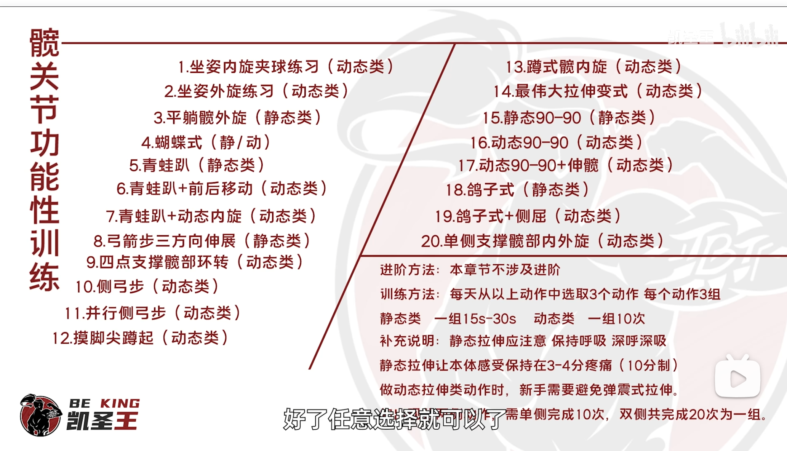

健身减重笔记

# 饮食计划

5-4 我的基础代谢：66+13.8 * 73.25+5 * 171-6.8 * 23=1776，系数1.4后2485，系数1.5后2665

5-30 我的基础代谢：66+13.8 * 71.45+5 * 171-6.8 * 23=1750，系数1.4后2450，系数1.5后2625

食堂的早饭：主食+蛋+奶：【大肉包/全麦2片/花卷】+水煮蛋+【牛奶/豆浆/豆腐脑250ml】

麦麦的早饭：【火腿230，烟肉280，板烧280，猪柳麦320，吉士330，猪柳蛋390】+【香肠60】+【牛奶135，豆浆155】=【365，605】

食堂的午饭：主食+荤+2素：【1拳米饭】+【1掌心瘦肉/鱼】+【2拳蔬菜】

麦麦的午饭：【吉士300，麦香鸡370，板烧400，双层吉士440】+【玉米杯90】+【麦乐鸡180，辣翅180】=【570，700】

理想的晚饭：【同午饭，少米饭】【JG凉面+素菜】【JG滑蛋饭+素菜】

麦麦的晚饭：【麦香鸡340】+【蔬菜杯10】+【牛奶140】=490

## 碳水含量估算

鸡蛋0g，牛奶13g，大肉包30g，三明治45g。【2蛋1奶1主食=43-58g】

麦当劳，板烧汉堡38g，培根蔬萃双层牛堡36g，麦辣鸡腿堡44g，麦香鸡40g，麦香鱼38g，玉米杯9g，麦乐鸡12g，麦辣鸡翅8g。【板烧+玉米杯+麦乐鸡=59g】

虾仁滑蛋饭45+0+15=60g

【2蛋1奶1三明治】+【板烧+玉米杯+麦乐鸡】+【虾仁滑蛋饭】+【鸡胸肉+蛋】=【蛋白质125g，脂肪84g，碳水180g】【热量2150kcal】

## 蛋白质含量估算

1.5g/kg *72kg=110g 蛋白质

鸡蛋7g，牛奶8g，大肉包13g，三明治28g。【2蛋1奶1主食=35-50g】

麦当劳，烟肉蛋麦19g，图灵香肠3g，豆浆6g，合计28g

麦当劳，板烧汉堡23g，麦辣鸡腿堡23g，培根蔬萃双层牛堡25g，麦辣鸡翅12g，麦乐鸡13g

麦当劳，板烧汉堡+麦乐鸡+玉米杯=38g蛋白质，换麦香鸡的话合计28g，换培根蔬萃双层牛堡的话合计40g

虾仁滑蛋饭，15g

按最高的算，103g

按最低的算，78g

## 脂肪含量估算

鸡蛋6g，牛奶9g，大肉包10g，三明治20g。【2蛋1奶1主食=31-41g】

麦当劳，培根蔬萃双层牛堡23g，板烧汉堡18g，麦辣鸡腿堡26g，麦香鸡16g，麦香鱼14g，玉米杯1g，麦乐鸡13g，麦辣鸡翅11g。【板烧+玉米杯+麦乐鸡=32g】

虾仁滑蛋饭1g

## 合计表格

完整版见同目录下 foods.xlsx

| 食物             | 碳水 | 蛋白质 | 脂肪 | 热量 |
| ---------------- | ---- | ------ | ---- | ---- |
| 水煮蛋           | 0    | 7      | 6    | 80   |
| 牛奶             | 13   | 8      | 9    | 150  |
| 大肉包           | 30   | 13     | 10   | 230  |
| 三明治           | 45   | 28     | 20   | 460  |
| 小碗馄饨         | 30 | 12 | 15 | 300 |
| 大碗馄饨         | 48 | 20 | 24 | 480 |
| 猪柳蛋汉堡 | 27 | 23 | 21 | 390 |
| 烟肉蛋麦汉堡 | 26 | 20 | 20 | 280 |
| 图灵香肠 | 1 | 3 | 4 | 50 |
| 豆浆 | 25 | 7 | 3 | 150 |
| 板烧汉堡         | 38   | 24 | 17 | 400 |
| 培根蔬萃双层牛堡 | 36   | 26 | 24 | 470 |
| 麦辣鸡腿堡       | 42 | 24 | 24 | 480 |
| 麦香鸡 | 41 | 16 | 17 | 390 |
| 麦香鱼 | 37 | 16 | 14 | 340 |
| 麦乐鸡4块 | 10 | 10 | 10 | 180 |
| 麦乐鸡5块 | 12 | 13 | 13 | 220 |
| 麦辣鸡翅 | 8 | 10 | 13 | 190 |
| 虾仁滑蛋饭 | 60 | 15 | 1 | 310 |
| 葱爆牛肉盖浇饭 | 50 | 32 | 8 | 440 |
| 合味道大碗猪骨浓汤面 | 62 | 11 | 27 | 550 |
| 雨润王中王小根火腿 | 3 | 5 | 5 | 90 |
| 夹味饼8块版（饼+生菜+里脊+荷包蛋） | 3+1+38=42 | 5+8+7=20 | 0.3+9+4=14 | 380 |
| 蒙牛鲜奶盒装450ml | 23 | 13 | 17 | 310 |
| 土豆牛肉盖浇饭（加饭） | 70 | 32 | 8 | 520 |
| 明治醇壹鲜奶盒装450ml | 23 | 16 | 16 | 315 |
| 橙子 | 20 | 2 | 0 | 80 |
|  |  |  |  |  |
|  |  |  |  |  |
|  |  |  |  |  |

---

# 训练计划

## 动作要领

| 周日       | 周一    | 周二  | 周三       | 周四    | 周五  | 周六 |
| ---------- | ------- | ----- | ---------- | ------- | ----- | ---- |
| 胸/三头/腹 | 背/二头 | 腿/肩 | 胸/三头/腹 | 背/二头 | 腿/肩 | ---  |

肩膀：注重中束和后束，包括：【哑铃反向飞鸟：后束】【哑铃侧平举：中束】【器械肩推】

肩膀2：坐着-跪着-站着，3-4组，77710【哑铃侧平举】【前挺举】【后束划船】【阿诺推举】

> 哑铃推肩
>
> - 肩胛面运动，不要冠状面运动
> - 腹式呼吸，胸下沿别动
> - 小臂直上直下，不用夹到头顶，下放放到下巴即可

三角肌后束：【龙门架X型后束拉】

> 龙门架X型后束拉：龙门架调到18。2种握法，掌心向上的，掌心向下的。向下的握法需要稍微俯身。注意沉肩，不知道怎么沉肩的可以先耸肩再沉肩。15RM反复做到力竭

腿：【深蹲】【单腿深蹲】【弓步】【宽距两侧蹲】

> 腿举：
>
> 1. 坐：骨盆不要抬起，在座位上塞紧，不准留缝隙，否则伤膝盖和腰椎
> 2. 起：慢下快上，到底不要弹，到顶膝盖 **严禁** 打直和锁死
> 3. 起：脚尖和膝盖方向要一致，宽窄中都要练，可以练的更全面
> 4. 踩的位置：低位练股四头肌，高位容易骨盆上来，所以踩中间

胸：【夹胸机】【卧推】【上斜哑铃卧推（椅子与地面30°）】【~~前倾双杠臂屈伸（易受伤）~~】

> 平板卧推：
>
> 垂直发力！
>
> 躺：杠的初始位置在眼睛正上方
>
> 脚：脚尖稍微分开，收回到膝盖后方，不可放松
>
> 手：全握，中立稍伸展，向外扭矩掰弯杠铃
>
> 小臂：推/放时垂直地面
>
> 肘：和身体夹角不超过60°
>
> 胸：放到底，推到肩膀正上方
>
> 背：肩胛骨下沉，锁住

> 夹胸机：
>
> 1. 后背不要贴死在靠背上，不然肩胛骨活动受限
> 2. 肘低于肩，不要平行，否则影响肩关节活动，剪切力
> 3. 胸大肌行程取决于肘的距离，所以夹到碰手还要伸直肘子

三头：【窄距卧推】【绳索三头下拉】【板凳臂屈伸】【~~哑铃颈后臂屈伸~~】【弯杠头颅粉碎者】

> 窄距卧推：
>
> - 握法：不要全握，否则手腕内侧要被压爆了，采用半握+大拇指顶住的握法降低压力
> - 肘：开肘是孤立训练三头的外侧头，肘贴近身体是训练三头全部（长头是增长潜力最大的头）
> - 推的位置：下胸的上方

> 绳索下拉时上身前倾，小臂的移动>90°，做全程，肘部贴近身体

> 头颅粉碎者，躺在健身凳上，双腿并拢离地，用弯杠，窄距握，从眼睛齐平处，大臂与身体夹角90-130°，大臂不动，小臂往头后放

> 粉碎者做完后不要停，继续窄距卧推，推的位置在锁骨和胸之间（greg说的）

腹：【卷腹】【抬腿雨刷】【体操提腹】

> 卷腹-肩胛骨离开地面，抬腿雨刷-骨盆离开地面，体操提腹-骨盆后倾

肱肌：【锤式弯举】

> 锤式弯举，弯举的方向要越过身体中线，向身体中线弯，弯到胸口

二头短头：【站姿外旋哑铃弯举】

二头长头：【借力站姿杠铃弯举】【服务生弯举】【上斜坐姿哑铃弯举】

二头兼顾：【反手引体向上】

> 蜘蛛弯举：胸靠弯举
>
> 服务生弯举：哑铃竖着，手掌托起哑铃，保持哑铃上表面的水平，直上直下
>
> 上斜坐姿哑铃弯举：哑铃凳靠背50°左右，放到底部的时候收缩三头

背部热身：【俯卧抻髋】【直臂绳索下压】【弹力带YW型+W型的伸直，比肩稍低】

背部水平拉类：【器械坐姿划船】【杠铃划船】

背部垂直拉类：【高位下拉（攀岩式单侧）】【引体向上】【直臂绳索下压】

> 引体向上
>
> - 握距稍宽于肩最佳
> - 抓握尽量用手心抓单杠而不是手指像勾子勾住单杠
> - 下半身脚尖向下，腿伸直，股四头肌收紧，核心收紧（想一想小时候被妈妈抱起来时侯，全身收紧是妈妈最轻松的姿势，我觉得这和筋膜线有关系）
> - 想象把杆往下拉，这样可以展开胸椎
> - 肩胛要下沉，不可以松，不然伤肩膀，在下沉的状态下肩胛骨随着手臂上抬而动，叫做肩肱节律

背部划船类：【胸部支撑触碰式哑铃划船+递减组】【w提举】【单侧哑铃划船】

> 传统硬拉（jeff）
>
> jeff认为硬拉是两阶段的，第一阶段是蹬腿，第二阶段是伸髋。第一阶段类似倒蹬机的发力，把地面踩穿的感觉，该阶段需要注意启动时杠铃的位置（可以看到鞋带从杠铃的前面露出来，下蹲时小腿自然碰杠），背部刚性（挺胸，肩胛骨下沉，背阔肌收紧，下背处于中立位，不要反弓也不要正弓），手臂（握距稍宽于膝盖，手臂直），杠铃从地面被蹬起，到膝盖的高度。第二阶段是髋关节主导的伸髋，该阶段膝盖不需要动了，靠髋关节铰链、下背的肌肉伸髋，拉到顶点。

体态矫正：【‌农夫行走】【‌斜方举起】

> 坐姿器械划船：锻炼背阔肌而非斜方肌，屁股稍微坐前面点，拉的时候腰部不要反弓，核心要收紧，盆骨可以稍微后倾。斜方肌代偿即可停止
>
> 农夫行走：手提哑铃等重物，锻炼上部斜方肌
>
> 斜方举起：杠铃片举过头顶，锻炼下部斜方肌

> 面拉动作要领：
>
> 高度：起始位置要略高于你的头部，这样能保证你是从上往下拉
> 终点：这是面拉，不是什么乱七八糟的过头拉，胸拉，所以终点是你的脸（最好在鼻子上）
> 握法：用反握 保证大拇指伸直可以对准自己，不然就是做肩膀内旋了
> 站姿：双脚平行站立就好，一定要维持稳定，不要让自己身体往前或是往后，如果控制不住，就有降低重量 确保质量
> 切记：要让手掌作为主导，在动作的最后，是手掌过背，而不是手肘
> 这个动作重量不能太轻了，不然没有用，但也不能过重，还是确保**动作质量**优先
> ps：你可以在拉到最后的时候，配合一个肩推 这样还能促进斜方肌下束的发展

> T杆划船技巧：主要训练背阔肌
>
> 1. 启动：蹲姿启动，站直但是后斜，中心在后面
> 2. 然后看手臂，需要紧贴身体，离得太远的话就要站前面点了，随后俯身
> 3. 小臂不要握太紧，重心在后侧，股四头肌如果累那就是重心太前了！
> 4. 下去的时候肩胛打开，上来的时侯顶住肩胛，夹紧手臂和背阔
> 5. 上来的时候不要用爆发力，要线性发力
> 6. 最大抗阻在最上面，启动的时候不要慢慢启动，否则后半段必定无力
> 7. 最大抗阻在最上面，不要一遇到最大阻力就放松，坚持着顶峰收缩
>
> 有一个争议：练哪里？
>
> 凯胜王：背阔，三角肌后束，三头，所以顶住肩胛，不要用肩胛内收的力，否则就会用到斜方肌中下部分
>
> 其他人：有练上背部的，就要求肩胛向下时打开，向上时缩

二头：注意无名指和小指攥紧杠，【绳索上拉】【95°坐姿哑铃弯举】【95°坐姿弯杠铃弯举】【哑铃弯举旋转】

## Gandy 的增肌增力混合计划

增力期持续1-3个月

减载15天

增肌持续3-6个月

减载7天

……（循环）

---

增力期计划：5x5训练法

一周三连，周135训练

力量分配：每个动作用的重量都是5RM*50%

---

增肌期计划：三分化法

组数：合计10组

腿日：

- 杠铃深蹲4组，12RM
- 哑铃箭步蹲4组，12RM
- 罗马尼亚硬拉2组，12RM

推日：

- 杠铃卧推4组，12RM
- 哑铃卧推3组，12RM
- 实力推举3组，12RM

拉日：

- 杠铃硬拉，12RM
- 杠铃划船，12RM
- 引体向上，12RM

-

	

## Gandy讲练胸时的肩胛骨稳定

笔记

1. 稳定≠锁死！

   - 稳定时菱形肌（向后）和前锯肌（向下）发力，盂肱关节活动时肩胛骨会在很小的范围内运动  

   - 而锁死时，肩胛骨纹丝不动，盂肱关节活动受限，再试图卧推触胸会导致肩胛骨松掉

2. 如何稳定肩胛骨？
   - 肩胛骨下旋，向下巴方向挺胸，即掰杠的姿势

## 凯胜王讲5x5

适合人群：增力，主要针对II-B型肌纤维，容量多的部分是用于稳定肌训练，而非肌肥大

周期：3周储备周+1周转化周+1周卸载周

- 储备周：频率较高，练3休1，重量较低。重量用7PRE（7PRE=动作结束后还可以有3个的余力），如果力量变强或4次同样重量的训练后（收缩更快/6RPE等）就+2.5kg，但是绝不许+5kg
- 转化周：一周仅3练，重量用8-9RPE（8RPE=2个余力，9RPE=1个余力，9.5RPE=可能1个余力但不确定） 

- 卸载周：测试PR

禁忌： 

- 绝对禁止在储备周因状态好而私加重量
- 绝对禁止在转化周超过3次训练

## 凯胜王讲三分化

适合人群：刚出新手村的，主要针对训练的是II-A型肌纤维，并通过次数递减来带到I型和II-B型肌纤维

周期：2周力量+1周容量+1周卸载

- 力量周：重量上8-16组做组
- 容量周：重量上12-25组做组（最累的就是容量，所以绝不可超过1周）
- 卸载周：总容量减半，你可以是组内次数减半，也可以是组数减半，偏力量或偏容量均可以

训练频率：老手练3休1

训练容量：总和18-20组

训练动作的选择：复合为主，孤立少练，单组重量必须递进，然后次数递减（为什么？因为这样可以让I型肌纤维先练，然后到II-A，最后II-B，这样练的全面。如果一直使用16个一组，那么只能练到一种肌纤维），力量周按16->8递减，容量周按18->12递减

- 推：杠铃卧推，上斜卧推，窄距卧推，实力推（个人情况建议换哑铃推肩，因为4个自由重量已经让神经很累了），夹胸
- 拉：硬拉，平拉绳索划船，T杆划船（最累），高位下拉，二头弯举（为什么没有俯身划船？因为硬拉已经很累了，你需要坐着）
- 蹲：杠铃深蹲，腿举，腿屈伸，腿弯举（为什么用腿举和腿弯举这俩器械型？因为深蹲已经很累了）

## 凯胜王讲热身

胸部热身：

1. 有氧5分钟：身体升温，进入分解模式
2. 斜方肌：抬杠
3. 胸小肌：网球搓
4. 胸椎活动度：骨盆中立，后展手臂
5. 肘关节稳定：站姿面墙平板支撑
6. 揉搓肩肘关节
7. 肩关节活动度：弹力带肩绕环
8. 前锯肌激活：弹力带前推
9. 肩袖肌群激活：弹力带小熊摊手，招财猫
10. 募集肌肉：夹胸

背部热身：

1. 最伟大拉伸/背部拉伸
2. 斜方肌：抬杠
3. 胸小肌：自己按
4. 肩关节活动度：弹力带肩绕环
5. 前锯肌激活：趴墙上下摸/服务生托举
6. 放松小臂内侧
7. 肩胛：弹力带，内收下降下回旋
8. 募集肌肉：手握哑铃，收紧背部，胸椎前推

深蹲热身：

1. 有氧5分钟
2. 膝关节：揉搓
3. 胸椎活动度：蹲姿，一手抓异侧脚，另一手臂向后上展
4. 胸大肌/内旋肌/背阔肌拉伸
5. 足背屈活动度：弹力带拉伸
6. 屈髋：弓箭步伸展，早上好
7. 髋膝联动：臀桥，俯卧后踢
8. 足踝活动度：泡沫轴滚小腿

​                                                                       

## 好人松松讲分化训练

胸：推类动作为主，夹胸非必要

背：下拉类+划船类

腿：前侧（蹲），后侧（直腿硬拉，腿弯举）

我现在的错误：

- 练背的时候练了硬拉，就不练划船了！下拉拉的种类太多了。。垃圾容量
- 练腿的时侯只练了前侧，后侧没有练！以后要把器械腿弯举加进来！
- 练肩的时侯，中束日一般只练了推举，前束日也是只练了推举，动作要增加一个嗷
- 二头和三头动作选2即可，避免垃圾容量

## 好人松松讲划船/下拉

上下背肌肉识别

划船总结

常见错误

---

下拉

## 好人松松讲推胸类型

## 卓叔讲肌肥大类型

肌肉由肌纤维组成，

肌纤维由肌原纤维+肌质组成，

肌原纤维：

- 决定了肌肉的力量，增长潜力小
- 对维度帮助不大
- 用5RM及以下重量训练，磷酸肌酸供能

肌质：

- 作为营养液给肌原纤维功能，增长潜力大
- 对力量帮助0，对耐力帮助中，对维度帮助很大
- 用8-12RM重量训练，糖酵解供能

## 凯胜王讲练肩

动作顺序：由弱到强，后束-中束-前束

动作组数：递减组/金字塔，12组-16组

使用重量：小重量

离心：不要刻意慢下，假如向心1s，离心就1.2s就可以了

后束：

- [ ] 龙门架X型：虚握；手腕不要扭，和小臂平行；拉的时侯肘的角度不要变；不要用肩胛去带动，而是大臂带动
- [ ] 面拉：是先拉，然后以肘关节为轴旋转，手比肘更后

中束：

- [ ] 坐姿哑铃推肩：不要耸肩，不是推到顶就完事了；到顶要保持肩部后束的收紧
- [ ] 哑铃侧平举：手腕和小臂平行，否则容易小臂酸；肩峰撞击可以外旋手臂

前束：

- [ ] 前平举：手臂握着哑铃下垂的时侯，想象有一个力在阻止你往上起，与它做对抗，然后再起，这就是发力感

## 凯胜王讲练背

练背为什么难？

- 练背的动作，都是启动时侯轻松，到拉到最末端的时侯压力最大（高位下拉拉到底，划船划到收紧）
- 而练胸，练腿的动作，都是中间难，结束时侯容易（卧推，推肩，深蹲）
- 顶峰收缩时侯要求的力量是行程中最大的，所以难

宽握/中握得高位下拉：肩胛骨要内收，沉肩，不许后仰，直着做，训练中下斜方肌

V把下拉：肩胛骨不要内收，沉肩，要顶开，也不许后仰，直着做，训练背阔肌

山羊挺身：下去的时侯低头，上来的时候昂头，训练竖脊肌

## 凯胜王讲力量训练金字塔

笔记

1. 1RM的提升不是每天练1RM，而是综合练8-12甚至更多RM练出来的。
2. 肌肉力量大小的决定因素
   - 肌肉体积：臂围越大越强。
   - 肌肉长度：以二头弯举为例，这是一个有近端和远端的肌肉，直立弯举时，平衡点在中间；向前俯身弯举时，近端收缩了，主要练远端，力量下降？躺在上斜凳上弯举时，近端远端都拉长了，力量下降？
   - 收缩速度：收缩速度越快，力量越大。以卧推为例，要是推这个的时侯很轻松就起来了，那下一个肯定没问题；反之，要是推这个起的很慢很慢，那下一个必被压。
   - 肌纤维类型：红白肌
     - 白肌还分II-A和II-B型
     - II-A型是I和II的混合，耐力稍微好点，30s以上的肌肥大训练，是糖分解为ATP和乳酸，糖酵解系统
     - II-B是纯II，力量举1RM，5x5训练，直接ATP-CP供能
   - 神经系统控制能力：预疲劳技术。以卧推80kg 5x5为例，上来就80会很累，但是你60 70 80然后90，90只做出杠和厘米推，然后去推80就会很舒服。
3. 辅助性训练很重要，指针对稳定肌群的训练，例如卧推时侯前锯肌，菱形肌

## 凯胜王讲训练的结构

笔记

1. 没有结构的重量就不要往上加了，没有意义。你说一个深蹲膝盖往前定了，硬拉背部刚性没了，硬怼起来，对长肌肉有意义吗？没有
2. 龟背硬拉190，新手看不懂，高手看小丑。。
3. 如果硬拉搞到140的时侯背部刚性没了，那训练就要围绕120，130练了，然后去思考怎么提升背部刚性
4. 拉伸有用吗？
   - 对长肌肉有用吗？没有
   - 对放松肌肉有用吗？对肌腱放松有用吗？对改善体态有用吗？有用啊！你不做就直接负面影响了
   - 所以那种研究了拉伸对肌肥大没有作用的文章，他只是从一个小角度切进去讲了，别的角度呢，没讲啊！直击肉崽

## 凯胜王讲决定力量大小的因素

这一讲可以很好的回答为什么要制定周期计划&为什么需要动态调整计划的问题。

笔记

1. 神经控制能力，决定力量大小
   - 肌肉体积到了，可是力量却不涨，为什么？因为身体的负反馈调节机制让你的神经控制能力不会时刻跟着肌肉一起涨，神经是涨得比较慢的。所以5x5这种训练里一定要有力量积累阶段，然后才是力量转化阶段。
   - 神经疲劳会降低力量。比如5x5或者3x5这种大重量训练，神经会疲劳，必须要卸载周来舒缓神经。
   - 而肌肥大训练，六分化，又称代谢压力训练，一般不需要卸载周，只需要在休息日多睡觉/拉伸按摩/高碳水即可。

2. 激素水平
   - 睾酮：脂肪吃少了睾酮会低，降低肌肉合成，所以减脂期不吃脂肪=又肥又小
   - 生长激素：晚上10点-凌晨2点是巅峰

## 刘三乐讲卧推

用双杠臂屈伸去强化前锯肌，变强了就可以上单杠，然后再吊环（很高级了，凯胜王都没到）

握距=卧推重量-10~15cm

要求动作流畅（不要出现停顿），保持节奏，再加重量（速度1m/s）

提高神经：三乐卧推一般都是100kg热身，很容易进入状态，说明他的神经募集很快

- 中小重量不要怼个数，要怼速度
- 大重量要分阶段专注，离心阶段注意力在背部，要推的时侯注意力在胸，半程往上注意力在三头手臂，这是要长期训练的

> 用弹弓的话，弹弓是帮你启动的，所以要多加入启动训练（底部暂停），不要弹胸
>
> 绑肘适合那些胸肌大的，启动快的，但是中程以上卡住的

卧推之背承载技术

- 掰杠：并非手臂掰就完事，而是要用肩胛下回旋带动手臂掰杠，这样会自然挺胸（建议先用小重量高位下拉找下回旋的感觉）
- 离心阶段背部不断收紧，触胸时背部最紧，此时蓄满了弹力
- 向心阶段想象自己是一个橡皮人，pong的把杠弹起来（注意，不是想象把杠推起来，而是想象自己背部往下陷）

## Travis讲卧推

（1）

bench more的意思是每周做10组以上卧推（2天，每次3组）->（3天，每次3组）->（3天，每次4组）

（2）

将肌肥大，爆发力，肌力量结合起来

Day1：肌肥大：3x8

Day2：爆发力：3x6

Day3：绝对力量：3x3

（3）

做变种的卧推：弹力带推，箱式推，哑铃推，离心推等

（4）

弱点攻克

- 底部启动：前束弱
- 中部：
- 顶部锁定：三头弱

（5）

每周1次峰组（top set）

90%最大RM的重量，建立信心和提高期望

## 泽克约练颜钢（胸）

热身：蝴蝶机夹胸，1-3组，每组>12次，每组留2个力竭

- 肩胛不要后缩和上回旋，保持稳定
- 匀速，慢速离心
- 打开的时侯力往外走（不要让肩关节往后移动，而要让胸肌外展！），这样才能孤立胸大肌
- 达到充血/微微出汗

第一个动作（大重量）：器械上斜卧推，1热身+2过渡+2正式

- 热身：4片
- 过渡：4片，留3个余力，用于判断自己正式组推8个能使用的最大重量
- 正式：5片，做8个，要力竭

第二个动作（代谢压力：中等重量，高次数）：哑铃上斜卧推，1热身+3个正式组

- 正式：做15个，要力竭，后面不行了就降重量

第三个动作（代谢压力）：哑铃上斜卧推（对握，最大阻力矩改变，刺激胸中缝），3个正式组

- 正式：8个2010，5个1010，然后半程做到力竭
- 忘掉关节，只想着挤胸

第四个动作（代谢压力）悍马机推胸，2个正式组

- 正式1：8个2010，5个1010，然后半程做到力竭
- 正式2：7个半程，全程力竭，半程力竭

- 正式3：悍马机单侧推胸（一手推到底收紧胸部，另一只手推胸）。左5右5然后4321，然后左右同时半程做到力竭

使用所有动作的**2010原则：**

2：离心下放用时2s

0：不要停顿

1：向心1s

0：顶峰挤压后不要休息，继续下一次离心

体现：深蹲蹲8个，扛着杠铃歇几秒打打气继续做2个，反而是降低强度的，心率会下降，血液也会跑

向心/离心都要做到匀速的原因：速度快了后，参与的肌纤维会减少，肌肉有放空的阶段（练背尤其是这样）要像戳气泡一样，匀速的一个个戳破

顶峰停顿vs顶峰收缩：想象拧毛巾，拧到拧不动为止

- 保持不动了，叫顶峰停顿
- 继续发力拧，叫顶峰收缩

在外部看是一样的，但实际难度后者更难

## 凯胜王坑渗透压

## 训练记录表

| 日期  | 早晨体重             | 早饭                                                         | 午饭                                                         | 晚饭                                                         | 运动内容                                                     | 合计热量 | 备注                                                         | 起床心率 | 空腹腰围 |
| ----- | -------------------- | ------------------------------------------------------------ | ------------------------------------------------------------ | ------------------------------------------------------------ | ------------------------------------------------------------ | -------- | ------------------------------------------------------------ | -------- | -------- |
| 5-4   | 73.25                | 1010素面+水煮蛋。400kcal                                     | 60盖浇饭，1荤2素。500kcal                                    | 板烧汉堡+玉米杯+麦乐鸡+可乐。700kcal                         | 3组仰卧起坐，3组反向卷腹，2组平板支撑，2组臀桥，2组哑铃。自由泳1km+蛙泳300m。饮料100kcal | 1700kcal |                                                              |          |          |
| 5-5   | 72.95                | 40半张饼+水煮蛋+豆腐脑。300+100+120=520kcal                  | 麦香鸡+玉米杯+麦辣鸡翅+可乐。666kcal                         | JG虾仁滑蛋饭。700kcal                                        | 3组正反哑铃，3组脑后挺举，3组肱二头肌，2组拉绳，3组器材。自由泳1km+蛙泳500m。饮料100kcal | 1886kcal |                                                              |          |          |
| 5-6   | 72.95                | 1010韭菜盒子+水煮蛋+小馄饨。267+100+500=867kcal              | 麦香鸡+蔬菜杯+牛奶。490kcal                                  | JG虾仁滑蛋饭+豇豆炒肉，一半的饭。600kcal                     | 3组反向飞鸟，3组哑铃侧平举，3组器械肩推，3组深蹲，3组弓步，3组宽距两侧蹲。自由泳1km+混合300m。饮料100kcal，水煮蛋100kcal | 2157kcal |                                                              |          |          |
| 5-7   | 72.30                | 1010大肉包+水煮蛋+牛奶。230+100+150=480kcal                  | **欺骗餐**，水林间，700g牛羊肉，甜品2个，寿司2个，小菜若干。1400+200+120 * 0.3 * 2+50=1722kcal | 一碗牛奶燕麦粥，花菜，芦笋烧肉。300+80+80=460kcal            | 休息                                                         | 2662kcal |                                                              |          |          |
| 5-8   | 72.65                | 1010大肉包+水煮蛋+牛奶。230+100+150=480kcal                  | JG鸡肉滑蛋饭。600kcal                                        | JG虾仁滑蛋饭。600kcal                                        | 3组哑铃卧推2.5kg，3组卧推2.5kg，3组夹胸。3组绳索下拉，3组哑铃颈后臂屈伸。3组卷腹，3组抬腿雨刷，1组平板支撑。自由泳1km+混合300m。饮料100kcal，茶叶蛋100kcal | 1880kcal |                                                              |          |          |
| 5-9   | 72.35                | 1010大肉包+水煮蛋+牛奶。230+100+150=480kcal                  | 板烧汉堡+玉米杯+麦乐鸡+可乐。700kcal                         | JG虾仁滑蛋饭+花菜。600kcal                                   | 3组5kg哑铃弯举，3组5+5+7.5kg哑铃弯举旋转，3组5kg弯杠铃弯举。3组高杆下拉，3组屈臂伸/引体向上，3组绳索拉杆。自由泳1km+蛙泳500m。饮料，茶叶蛋，春见。100+50+100=250kcal | 2030kcal |                                                              |          |          |
| 5-10  | 72.05                | 1010大肉包+水煮蛋+牛奶。230+100+150=480kcal                  | 不素之霸汉堡+玉米杯+麦乐鸡+可乐。750kcal                     | JG虾仁滑蛋饭+菌菇青椒炒蛋。600kcal                           | 3组器械推肩，3组jeff坐跪站超级组5+5+2.5kg。3组深蹲，3组弓步，3组横弓步，3组器械推腿10kg。自由泳1km+蛙泳100m。饮料，茶叶蛋。100+50=150kcal | 1980kcal |                                                              |          |          |
| 5-11  | 72.35                | 1010大肉包+水煮蛋+牛奶。230+100+150=480kcal                  | 60盖浇饭，1荤3素。600kcal                                    | 夜小堡+麦辣鸡翅+玉米杯。450+180+80=710kcal                   | 6组30°上斜哑铃卧推，5+5+5+7.5+7.5+10kg，3组卧推，5kg，3组夹胸机，40+40+50lb。3组绳索下拉，3+4+3重块，3组头颅粉碎者+窄距卧推，空杆。3组卷腹+抬腿雨刷+空中脚踏车，1组平板支撑30s。自由泳1km+蛙泳200m+自由泳200m。饮料，春见。100+100=200kcal | 1990kcal |                                                              |          |          |
| 5-12  | 72.35                | 烟肉蛋汉堡+图灵香肠+豆浆。280+50+150=480kcal                 | 60盖浇饭，1荤3素。油多，650kcal                              | JG虾仁滑蛋饭，6.5虾仁。600kcal                               | 5组站姿哑铃弯举，5+5+5+7.5+7.5+7.5kg。3组弯杠弯举5kg。3组高杆下拉，4+4+5重块。3组宽握/窄握引体向上，130kg。3组绳索下拉，3+4+5重块。自由泳1km+混合100m。饮料，茶叶蛋。100+50=150kcal | 1880kcal | 体重不变了，怀疑是增肌>减脂                                  |          |          |
| 5-13  | 72.90                | 1010大肉包+水煮蛋x2+春见。230+200+100=530kcal                | 腊汁肉拌面，2/3面。700kcal                                   | JG虾仁滑蛋饭+菌菇青椒，油多。600kcal                         | 5组器械推肩，20+20+25+40+40kg。3组坐跪站超级组5+5+5kg。3组深蹲，3组弓步，3组横弓步，3组器械推腿25kg。饮料，茶叶蛋，春见。100+50+100=250kcal | 2080kcal | 体重涨了0.6kg，新手超量增肌期？                              |          |          |
| 5-14  | 72.15                | 1010大肉包+水煮蛋+牛奶。230+100+150=480kcal                  | **欺骗餐**，一绪烧肉约700g牛肉，1小只墨鱼仔，1盘鸡软骨，1只芝士烤虾，1罐维他柠檬茶。1400+30+100+20+150=1700kcal | 绿豆粥，青菜，一根玉米。150+100+80=330kcal                   | 休息                                                         | 2510kcal |                                                              |          |          |
| 5-15  | 72.15                | 奥利奥x1+牛奶。300+150=450kcal                               | JG一荤两素一汤。600kcal                                      | JG鸡肉滑蛋饭。600kcal                                        | 3组器械推胸，20+20+25kg。5组上斜哑铃卧推，5+7.5+7.5+10+10kg。3组平板卧推，10kg。3组器械夹胸，20+25+30kg。3组山羊挺身，0+5+5kg。3组绳索下拉4+5+6重块。3组卷腹+抬腿雨刷+空中脚踏车+平板支撑30s。自由泳1km。饮料+茶叶蛋。100+50=150kcal | 1800kcal |                                                              |          |          |
| 5-16  | 72.10                | 1010大肉包+水煮蛋+牛奶。230+100+150=480kcal                  | 板烧汉堡+玉米杯+麦辣鸡翅+可乐。400+80+180=660kcal            | 牛肉凉面。500kcal                                            | 4组上斜哑铃弯举，5+7.5x3。3组站姿哑铃弯举，7.5+7.5+10kg。3组站姿弯杠弯举，5kg。3组俯卧抻髋。3组高位下拉，4+6+6重块。3组引体向上，55+55+45kg。3组山羊挺身。1000自+600蛙+400自蛙混合。饮料+膳当家牛肉。100+200=300kcal | 1940kcal |                                                              |          |          |
| 5-17  | 72.80                | 1010三明治+水煮蛋x2+牛奶。460+200+150=810kcal                | 干切牛肉拉面。450kcal                                        | JG虾仁滑蛋饭。600kcal                                        | 3组器械推肩，4+6+6重块。3组坐跪站超级组，5kg。3组俯身飞鸟，5+7.5+5kg。3组哑铃侧平举7.5kg。3组深蹲+弓步+横弓步。2组俯卧抻髋。1000自+300自+200蛙。饮料+小蛋糕。100+350=450kcal | 2310kcal | 早上水喝多了？                                               |          |          |
| 5-18  | 72.55                | 1010韭菜盒子+水煮蛋x2+牛奶。230+200+150=580kcal              | 培根蔬萃双层牛堡+麦乐鸡+玉米杯。460+170+80=710kcal           | JG虾仁滑蛋饭+花菜。600kcal                                   | 3组上斜哑铃卧推，5+7.5x3kg。8组卧推，5+7.5x3+10x4kg。3组器械推胸，3+5+5重块。反向蝴蝶卷腹+侧向平板起身左/右+异侧膝触肘+后手支撑提膝+平板支撑异侧碰脚趾+蛙式卷腹，2套。3组绳索下拉，3+5+6重块。3组头颅粉碎者+窄距卧推，2.5kg。3组仰卧撑。500自。饮料+茶叶蛋。100+50=150kcal | 2040kcal | 下次试试卧推10kg 12RM                                        |          |          |
| 5-19  | 72.45                | 50千层饼半张+水煮蛋+豆腐脑。450+100+120=670kcal              | 干拌豌杂面，一半的面+豌杂。300+200=500kcal                   | 春见+JG虾仁滑蛋饭+青菜。700kcal                              | 5组站姿哑铃弯举，5+7.5x3+10kg，4组站姿弯杠弯举，2.5+5x3kg，3组低处绳索弯举，3+5+6重块，3组坐姿胸靠弯杠弯举，2.5kg。5组器械高位下拉，3+5+5+6+6重块。4组直臂绳索下拉，3+5+6+6重块。2组单侧扶凳哑铃划船，5+7.5kg。3组杠铃划船，2.5kg。4组龙门架高杆下拉，13.5+36+54x2kg。1组俯卧抻髋。1组山羊挺身。饮料+水煮蛋。10km/h配速跑步10min。100+50=150kcal | 2020kcal |                                                              |          |          |
| 5-20  | 72.60                | 1010三明治+荷包蛋。460+120=580kcal                           | 巨无霸+麦辣鸡翅+玉米杯。490+180+80=750kcal                   | 1010串串+肉+冬瓜+半碗米饭。700kcal                           | 校庆，休息                                                   | 2030kcal | 昨天有氧少了                                                 |          |          |
| 5-21  | 72.20                | 起晚了，牛奶。150kcal                                        | **欺骗餐**，鱼片，鱼肉，肥牛，米线，蔬菜，菌菇。400+100+600+200+50+100=1450kcal | 奥利奥x2，550kcal                                            | 3组器械推肩，3+4+5+6重块。3组坐跪站超级组，7.5+5x2kg。3组反向飞鸟，5+7.5x2kg。3组自重深蹲。3组小杆深蹲2.5kg。3组深蹲架深蹲，空杆。1000自。饮料+茶叶蛋+春见。100+50+100=250kcal | 2400kcal |                                                              |          |          |
| 5-22  | 71.85                | 起晚了，奥利奥+牛奶。275+150=425kcal                         | JG虾+青菜+花菜炒肉+米饭。700kcal                             | JG虾仁滑蛋饭。600kcal                                        | 4组器械推胸，3+4+5+6重块。4组平板卧推5+10x3kg。2组上斜卧推10kg。3组器械夹胸，3+5+6重块。5组绳索下拉，3+5+6+6+7重块。2组器械下推，3+5重块。2组头颅粉碎者+窄距卧推，2.5kg。反向蝴蝶卷腹+侧向平板起身左/右+异侧膝触肘+后手支撑提膝+平板支撑异侧碰脚趾+蛙式卷腹，20/25个，2套。2组下腿自由式，左右各10圈。2组平板支撑，30+40s。1000自。饮料+五香牛肉。100+100=200kcal | 1925kcal | 秤不准？昨天没算好？上斜卧推差点出事，头颅粉碎者砸到了手     |          |          |
| 5-23  | 71.75                | 1010三明治+牛奶。460+150=610kcal                             | 60虾+大排+菠菜炒蛋+米饭。50+250+100+200=600kcal              | JG牛肉凉面+荷包蛋+生菜。500+100+80=680kcal                   | 4组上斜哑铃弯举，5+7.5x3kg。4组站姿哑铃弯举，10+7.5x3kg。3组站姿弯杠弯举，5kg。3组坐姿胸靠弯杠弯举，2.5kg。6组高位下拉，7x3+5x3重块。3组龙门架高杆下拉，45+54x2kg。2组单侧扶凳哑铃划船，5+7.5kg。3组山羊挺身，0x2+5kg。3组引体向上，45kg。3组杠铃划船，5kg。1000自，200混合。饮料+茶叶蛋。100+50=150kcal | 2040kcal | 还是递增组吧，上来就极限实在难                               |          |          |
| 5-24  | 72.05                | 1010三明治+牛奶。460+150=610kcal                             | 板烧汉堡+玉米杯+麦乐鸡+油桃。400+80+180+40=700kcal           | JG鸡肉滑蛋饭+豆角碎肉。650kcal                               | 4组器械推肩，3+5+5+6重块。3组坐跪站超级组，5kg。3组站姿哑铃侧平举，7.5kg。1组坐姿哑铃反向飞鸟，5kg。5组器械坐姿哑铃飞鸟，3重块。3组深蹲+弓箭步+侧弓箭步。4组深蹲架深蹲，0x2+2.5x2kg。1组俯卧抻髋。1000自+100自+100自蛙。饮料+茶叶蛋。100+50=150kcal | 2110kcal | 器械反向飞鸟是个好动作，后束感受不错                         |          |          |
| 5-25  | 72.05                | 1010大肉包+水煮蛋x2+牛奶。230+80x2+150=540kcal               | 虾堡+玉米杯+麦辣鸡翅。500+80+180=760kcal                     | JG虾+青菜+花菜+米饭。150+100+100+250=600kcal                 | 4组器械推胸，3+5+6+6重块。2组哑铃平板卧推，5+7.5kg。6组平板卧推，5+10x5kg。5组器械夹胸，3+5+6x3重块。5组绳索下拉，3+5+6x3重块。3组头颅粉碎者+窄距弯杠卧推，2.5kg。3组仰卧撑，12个。反向蝴蝶卷腹+侧向平板起身左/右+异侧膝触肘+后手支撑提膝+平板支撑异侧碰脚趾+蛙式卷腹，20个，2套。2组下腿自由式，左右各10圈。3组平板支撑，35+40+45s。1000自。饮料+五香牛肉+油桃。100+50+40=190kcal | 2090kcal | 按陈柏龄卧推方法注意了一下，确实有感觉。下次改重量，3组5次试试。 |          |          |
| 5-26  | 72.15                | 1010大肉包+水煮蛋x2+牛奶。230+80x2+150=540kcal               | 臊子油泼面。700kcal                                          | JG虾仁滑蛋饭。600kcal                                        | 5组站姿哑铃弯举，5+7.5x3+10kg。2组单侧站姿哑铃弯举，10kg。4组弯杠弯举，5x3+7.5kg。3组卧推，7.5x2+10kg，8RM。饮料+橘子。100+40=140kcal | 1980kcal | 早上水喝多了or右侧腹部不舒服。今天和教练学习了卧推/胸部发力/垂直发力的技巧 |          |          |
| 5-27  | 72.00                | 40一张饼+水煮蛋+豆腐脑。600+80+120=800kcal                   | 麦香鸡+椰子水。370+50=420kcal                                | JG肉圆+生菜+四季豆炒肉丝+米饭。600kcal                       | 肩袖热身。4组器械推肩，3+5+6+7重块。3组坐跪站超级组，5kg。1组哑铃侧平举，5kg。1组坐姿哑铃反向飞鸟，5kg。3组器械坐姿反向飞鸟，3重块。3组深蹲，2组弓箭步+侧弓箭步。1000自。饮料+橘子。100+40=140kcal。 | 1960kcal | 手指受伤的地方疼，减训练量了。                               |          |          |
| 5-28  | 72.15                | 1010大肉包+水煮蛋x2+牛奶。230+80x2+150=540kcal               | **欺骗餐**，水煮肉片+上汤娃娃菜+米饭。600+100+300=1000kcal   | JG炸牛肉块+丝瓜炒蛋+青菜+米饭。600kcal                       | 休息                                                         | 2140kcal |                                                              |          |          |
| 5-29  | 71.45                | 和味道泡面+牛奶。350+150=500kcal                             | JG白切鸡+蒜苗香干炒肉丝+四季豆炒香干+米饭。400+150+100+200=850kcal | JG鸡肉滑蛋饭+青菜。600kcal                                   | 热身。4组绳索下拉，3+5+6+6重块。4组器械下推三头肌，3+5+6+6重块。4组平板卧推，10kg+12.5kg，10RMx3+5RM。4组器械推胸，3重块+30kgx3。反向蝴蝶卷腹+侧向平板起身左/右+异侧膝触肘+后手支撑提膝+平板支撑异侧碰脚趾+蛙式卷腹，30个，2套。2组下腿自由式，左右各10圈。3组平板支撑，40+45+50s。1000自。饮料。100kcal | 1950kcal |                                                              |          |          |
| 5-30  | 71.35                | 1010三明治+水煮蛋+牛奶。460+80+150=690kcal                   | 456盒饭，2荤3素。600kcal                                     | JG牛肉凉面+荷包蛋。500+100=600kcal                           | 热身。4组站姿哑铃外旋弯举，5+7.5x3kg。上斜哑铃凳哑铃弯举，5+7.5x2kg。3组站姿杠铃弯举，5kg。3组服务生弯举，5+7.5x2kg。1组上斜哑铃凳靠胸哑铃弯举，5kg。3组锤式弯举过中线，5kg。4组器械高位下拉，3+5x2+6重块。3组引体向上，45kg。1组杠铃划船，5kg。2组器械坐姿划船，3重块。饮料。100kcal | 1990kcal | 体测，体脂率20，体脂15kg，骨骼肌31kg。基础代谢1600kcal。建议体脂率16%，骨骼肌35kg。代谢2000kcal。此外，教练建议多练三角肌后束，三头肌和菱形肌。 |          |          |
| 5-31  | 71.75                | 猪柳蛋麦汉堡+图林香肠+豆浆。400+50+150=600kcal               | 虾堡+玉米杯+麦乐鸡块。500+80+180=760kcal                     | JG油面筋塞肉x2+青菜+四季豆炒肉丝+米饭。600kcal。             | 肩袖热身，招财猫+弹力带YW。4组器械推肩，3+5+6+7重块。3组坐跪站超级组，5kg。3组器械坐姿反向飞鸟，3+4+4重块。3组深蹲+弓箭步+侧弓箭步。3组深蹲架深蹲，0+5x2kg。3组俯卧抻髋。1000自+100自+100蛙。饮料+橘子。100+40=140kcal | 2100kcal |                                                              |          |          |
| 6-1   | 71.65                | 1010大肉包+水煮蛋x2+牛奶。230+160+150=540kcal                | 腊汁肉拌面。800kcal                                          | 培根蔬萃双层牛堡+麦乐鸡+玉米杯。460+170+80=710kcal           | 肩袖热身，弹力带YW。 4组器械夹胸，3+5+5+6重块。3组平板卧推肌肥大，10kg，10RM。3组平板卧推力量，12.5kg，5+5+8RM。3组器械推胸，3+4+5重块。4组器械三头下压，3+4+5+5重块。3组头颅粉碎者+窄距卧推。5kg，12RM。反向蝴蝶卷腹+侧向平板起身左/右+异侧膝触肘+后手支撑提膝+平板支撑异侧碰脚趾+蛙式卷腹，30个，2套。2组下腿自由式，左右各10圈。3组平板支撑，45+50+55s。饮料+五香牛肉。100+50=150kcal | 2200kcal | 头颅粉碎者，大臂不动，小臂弯曲，可以练三头。如果大臂动了那会练到前锯肌。 |          |          |
| 6-2   | 71.90                | 1010烧卖+水煮蛋x2+牛奶。150+160+150=460kcal                  | 板烧汉堡+玉米杯+麦辣鸡翅。400+80+180=660kcal                 | 60鸡肉+青菜+莴苣炒蛋+米饭。600kcal                           | 肩袖热身，弹力带YW。4组站姿外旋哑铃弯举，5+7.5x3kg。3组上斜哑铃凳哑铃弯举，5+7.5x2kg。3组站姿杠铃哑铃弯举，5kg。3组服务生弯举，7.5x2+10kg。3组锤式弯举过中线，5+7.5x2kg。2组俯卧抻髋。3组直臂绳索下压，3+5+6重块。3组器械坐姿划船，3+4+4重块。4组器械高位下拉，3+5+6+6重块，双-攀岩-攀岩-双。1000自。饮料+奶油蛋糕。100+100=200kcal | 1920kcal | 1000自成绩19.38，good！                                      |          |          |
| 6-3   | 71.80                | 1010蛋黄肉粽+荷包蛋+牛奶。200+100+150=450kcal                | **欺骗餐**，@冶春茶舍，扬州炒饭，糖醋排骨，酥炸藕盒，虾籽馄饨，春卷，三丁包，荷兰豆炒香肠，松鼠桂鱼，清炒西兰花。柠檬养乐多，饮料。1400+100+100=1600kcal | 板烧汉堡+玉米杯一口+麦辣鸡翅。400+180=580kcal                | 园博园，2w2步数。                                            | 2630kcal |                                                              |          |          |
| 6-4   | 71.90                | 奥利奥+牛奶。120+150=270kcal                                 | 50鸡肉+西兰花+丝瓜炒蛋+米饭，+酸牛奶。600+400=1000kcal       | 1010土豆丝+包菜+虾+米饭。600kcal                             | 肩袖热身。4组器械推肩，3+5+6+7重块。3组坐跪站超级组，7.5kg。3组深蹲+弓箭步+侧弓箭步。3组深蹲架深蹲，5+10+10kg。1000自，200自蝶混合。饮料。100kcal | 1970kcal | 坐跪站上7.5kg还有点不标准                                    |          |          |
| 6-5   | 71.10                | 鸡爪x2+牛奶。60x2+150=270kcal                                | 卤肉刀削面+酸奶。700+400=1100kcal                            | 藤椒鸡面。500kcal                                            | 肩袖热身。6组平板卧推，10x3kg，10RM，12.5x3kg，6RM。4组器械夹胸，4+6+6+7重块。5组绳索下拉，3+5+5+6+6重块。3组头颅粉碎者+窄距卧推，5kg。3组仰卧撑。1组jeff腹肌6件套，35-40个。下腿自由式，15个。平板支撑，60s。十字挺身，8个。饮料+五香牛肉+梨。100+50+100=250kcal | 2120kcal |                                                              |          |          |
| 6-6   | 71.90                | 1010小肉包x2+水煮蛋x2+牛奶。250+160+150=560kcal              | 虾堡+玉米杯+麦辣鸡翅。500+80+180=760kcal                     | JG虾仁滑蛋饭。600kcal                                        | 3组器械引体向上，45+40+40kg，10+8+8RM。4组器械高位下拉，3+5+6+6重块。4组器械坐姿划船，3+5x3重块。4组直臂绳索下压，4+6+6+7重块。3组扶架单侧哑铃划船，5+10+10kg。1组俯卧抻髋。3组杠铃划船，7.5kg。1组站姿哑铃弯举，5kg。3组上斜哑铃凳哑铃弯举，7.5kg。3组绳索上拉，4重块。3组服务生弯举，7.5x2+10kg。3组杠铃弯举，5kg。1000自。饮料+茶叶蛋+橘子。100+50+80=230kcal | 2150kcal |                                                              |          |          |
| 6-7   | 71.60                | 1010三明治+水煮蛋x2+牛奶。460+160+150=810kcal                | 板烧汉堡+玉米杯+麦乐鸡。400+80+180=660kcal                   | 456盒饭，2荤2素。650kcal                                     | 3组器械推肩，5重块。4组器械推胸，3+5+5+6重块。3组器械反向飞鸟，5重块。3组坐跪站超级组，5kg。3组器械腿推自己，5重块。3组自重深蹲。3组哑铃弓箭步，5+0x2kg。1组侧弓箭步。1000自。饮料+水煮蛋。100+80=180kcal | 2300kcal | 蛋白质估算50+38+15+7=110g                                    |          |          |
| 6-8   | 71.40                | 1010三明治+水煮蛋x2+牛奶。460+160+150=810kcal                | 60牛排饭。700kcal                                            | JG虾仁滑蛋饭+糖醋里脊。700kcal                               | 4组卧推，5+10x3kg，10RM。4组卧推，12.5kg，6x3+8RM。4组器械夹胸，3+5+6+6重块。4组器械三头下压，3+5+5+6重块。4组绳索下拉，4+6+7+7重块。3组头颅粉碎者+窄距卧推，5kg。3组仰卧撑。饮料+五香牛肉+水煮蛋+橙子。100+50+80+80=310kcal | 2520kcal | 感觉需要补充【推】类动作，哑铃卧推等。教练指出练三头需要大臂离身体近一点，碎颅者没法上大重量是个问题，要靠窄距卧推来改善。还建议把肩部分化到三天里。蛋白质估算50+25+20+6+7=108g |          |          |
| 6-9   | 71.60                | 1010三明治+水煮蛋x2+牛奶。460+160+150=810kcal                | 延边芝士板烧汉堡+玉米杯+冬阴功鸡翅。600+80+180=860kcal       | JG虾仁滑蛋饭+糖醋里脊。700kcal                               | 2组悬挂，25s。5组器械高位下拉，3+5+5+6+6重块。4组器械坐姿划船，3+5x3重块。3组扶架单侧哑铃划船，7.5+10+10kg。4组直臂绳索下压，4+6+8+8重块。3组上斜哑铃凳弯举，10kg。1组站姿哑铃弯举，5kg。4组服务生弯举，10+15x3kg。400自，100蛙。饮料+鸡蛋+橙子。100+80+80=260kcal | 2630kcal | 锤式弯举，绳索上拉，忘记做了……蛋白质估算50+38+20+7=115g      |          |          |
| 6-10  | 71.35                | 1010三明治+水煮蛋x2+牛奶。460+160+150=810kcal。              | 牛肉拉面+五香牛肉。500+50=550kcal。                          | JG虾仁滑蛋饭。600kcal                                        | 热身，3组器械反向飞鸟，3重块。3组肩部超级组，5kg。2组站姿哑铃侧平举，7.5kg。3组器械推肩，4+5+6重块。3组自重深蹲，2组弓箭步，1组侧弓箭步。3组深蹲架深蹲，10kg。500自。饮料+鸡蛋+橙子。100+80+80=260kcal | 2260kcal | 蛋白质估算50+26+15+7=98g                                     |          |          |
| 6-11  | 71.05                | 肉松面包+鸡胸肉+牛奶。300+70+150=520kcal。6+15+8g=29g        | **欺骗餐**，清蒸鲈鱼+干锅包菜+米饭。400+150+300=850kcal      | 肥牛鱼片米线。800kcal                                        | 休息                                                         | 2170kcal | 蛋白质估算29+80+15=124g                                      |          |          |
| 6-12  | 71.30                | 肉松面包+牛奶。480+150=630kcal。10+8=18g                     | 舌尖岛龙虾尾拌面。800kcal。30g                               | JG肉圆+芹菜炒香干+丝瓜炒鸡蛋+米饭。600kcal。15g              | 热身，3组器械推胸，5+6+7重块。4组上斜哑铃凳卧推，7.5+10+12.5+15kg。平板卧推，3组10kg 10RM，2组12.5kg 8RM，2组15kg 4+6RM，1组17.5kg 2RM。3组器械夹胸，5+7+9重块。3组窄距平板卧推，10kg，10RM。3组绳索下拉，6+7+8重块。3组碎颅者+窄距卧推，7.5kg，10-9-8RM。饮料+鸡胸肉。100kcal | 2130kcal | 平板卧推手臂不要伸直，保持肩部下压，不要动。绳索下拉8重块10RM达到极限，手臂伸不直了。下次练胸时候拿10kg热身，然后直接冲17.5kg力竭。教练说按现在的训练容量，80kg以下都5kg一加好了，不用2.5kg慢慢加。蛋白质估算18+30+15+15=78g。 |          |          |
| 6-13  | 71.30                | 1010三明治+水煮蛋x2+牛奶。460+160+150=810kcal。              | 板烧鸡腿堡+冬阴功鸡翅。400+180=580kcal。35g                  | JG虾仁滑蛋饭+糖醋里脊。700kcal。20g                          | 背：器械高位下拉 3组567重块 10RM。器械坐姿划船 3组579重块 10RM。绳索直臂下压 3组688重块 10RM。单侧哑铃划船 3组12.5kg 10RM。杠铃划船 3组10+15+15kg 10RM。二头：借力杠铃弯举 3组10kg 10RM。反手引体离心 2组 维持5s。上斜哑铃凳哑铃弯举 3组10+10+7.5kg 8RM。服务生弯举 3组15kg 10RM。锤式弯举 3组10kg 10RM。自由泳500m。饮料+橙子+鸡蛋。100+80+80=260kcal | 2350kcal | 高位下拉7已达极限。器械坐姿划船9已达极限。借力杠铃弯举10kg已达极限。服务生弯举，蜘蛛式难度>站姿，注意后三指支撑哑铃即可，食指要露出来。一套做完后锤式弯举10kg已达极限。蛋白质估算50+35+20+7=112g |          |          |
| 6-14  | 71.45                | 1010三明治+牛奶。460+150=610kcal                             | 板烧鸡腿堡+冬阴功鸡翅。400+180=580kcal。35g                  | JG虾仁滑蛋饭。600kcal。15g                                   | 热身。自重深蹲+弓箭步+侧弓箭步，3+2+1组。4组器械推腿，5566重块。4组深蹲架深蹲，10+10+15+15kg，10RM。2组硬拉，10kg，8RM。3组肩部超级组，5kg。3组面拉，566重块。5组龙门架X型后束拉，15RM，12RM。饮料+青提+鸡胸肉+酸牛奶。100+80+70+350=600kcal。 | 2390kcal | 蒋教练说我们的卧推能到75kg，人傻了。建议下次练肩膀先练后束。蛋白质估算36+35+15+15+14=115g |          |          |
| 6-15  | 71.60                | 1010三明治+水煮蛋x2+牛奶。460+160+150=810kcal。              | 延边芝士板烧鸡腿堡+冬阴功鸡翅。600+180=780kcal。35g          | 腊汁肉拌面。800kcal。15g                                     | 热身。平板卧推，10kg 10RM 1组，15kg 8RM 2组，17.5kg 8RM助力 2组，20kg 2RM 1组。器械推胸，567重块。窄距卧推，10kg，10RM，3组。绳索下拉，578重块，10RM，3组。自由泳1500。饮料+橙子+鸡蛋。100+80+80=260kcal | 2650kcal | 好久没游泳感觉心肺有点下降，但1km之后就好了。蛋白质估算50+35+15+8=108g |          |          |
| 6-16  | 71.40                | 烟肉蛋麦汉堡+图林香肠+豆浆+酸奶。280+50+150+150=630kcal。19+3+6+8=36g。 | 食其家鱼香茄子牛肉饭。600kcal。25g                           | JG虾仁滑蛋饭。600kcal。15g                                   | 热身，器械高位下拉，567重块。器械坐姿划船，578重块。单侧哑铃划船，10+12.5+12.5kg。杠铃划船，3组，15kg。绳索直臂下压，578重块。杠铃弯举，3组，7.5kg。上斜哑铃凳哑铃弯举，3组7.5kg。服务生弯举，3组，12.5+12.5+10kg。锤式弯举，3组，7.5kg。1000自。饮料+五香牛肉+鸡胸肉。100+50+80=230kcal | 2060kcal | 今天自由泳转体+侧打腿做的不错。蛋白质估算36+25+15+6+15=97g   |          |          |
| 6-17  | 71.60                | 1010三明治+荷包蛋+牛奶。460+80+150=690kcal。                 | 郭老二，酸辣白菜+葱烧牛蹄筋+米饭。800kcal。35g               | 板烧鸡腿堡+麦乐鸡+玉米杯。660kcal                            | 热身，龙门架X型后束，6组，1重块，15RM。自重深蹲3组，12RM。弓箭步1组20RM。器械推腿，567重块，10RM。深蹲架深蹲3组，10+15+15kg。肩部超级组3组，5kg。500自。饮料+绿茶+鸡胸肉。100+180+80=360kcal | 2510kcal | 渐进负重进步！蛋白质估算43+35+38+15=133g                     |          |          |
| 6-18  | 71.35                | 红豆面包+鸡胸肉+牛奶。420+80+150=650kcal。9+15+8=32g         | 肥牛鱼片米线。800kcal。15g                                   | JG毛血旺+炸鸡块+芹菜香干。700kcal。15g                       | 休息。酸奶150kcal。8g。                                      | 2300kcal | 肩膀还是疼。蛋白质估算70g                                    |          |          |
| 6-19  | 70.80                | 红豆面包+鸡胸肉+牛奶。420+80+150=650kcal。9+15+8=32g         | JG精品牛肉面。700kcal。15g                                   | JG苋菜+花菜炒肉+排骨汤+米饭，一半的量，+天津童子鸡半只。800kcal。30g | 热身。器械推胸，567重块。上斜哑铃卧推，10+10+12.5kg。平板卧推，空杆10RM，10kg 10RM，15kg 10RM，17.5kg 4+4RM，6+3RM。器械三头下压，567重块。绳索下拉，677重块。碎颅者+窄距卧推，7.5kg，12+10RM，3组。饮料+牛奶。100+150=250kcal | 2400kcal | 体重暴跌，怀疑睡眠不好，周末也不能熬夜啊！！有氧少了，蛋白质估算32+15+30+8=85g |          |          |
| 6-20  | 71.20                | 牛肉饼+水煮蛋x2+牛奶。230+160+150=540kcal。13+14+8=35g       | 麦辣鸡腿堡+冬阴功鸡翅+酸奶。520+180+150=850kcal。23+12+8=43g | 40里脊肉松煎饼+苋菜+豆浆。700kcal。15g                       | 热身。器械高位下拉，566重块。器械坐姿划船，678重块。直臂绳索下压，567重块。杠铃划船，15+10+10kg。服务生弯举，10+15+15kg。杠铃弯举，7.5kgx3。锤式弯举，10+7.5x2kg。1000自。饮料+鸡蛋+鸡胸肉。100+80+80=260kcal | 2350kcal | 蛋白质估算35+43+15+7+15=115g                                 |          |          |
| 6-21  | 71.30                | 1010三明治+水煮蛋x2+牛奶。460+160+150=810kcal。50g           | 板烧鸡腿堡+冬阴功鸡翅+鸡胸肉。400+180+80=660kcal。35+15=50g  | JG虾仁滑蛋饭。600kcal                                        | 热身。器械推肩，567重块。肩部超级组，5kg。自重深蹲+弓箭步。器械推腿568重块。深蹲架深蹲，15+20+20kg。1000自。饮料+鸡蛋+橙子。100+80+80=260kcal | 2330kcal | 器械推腿：脚尖高度高于膝盖，与肩同宽，脚后跟用力，髋部用力，伸直不锁死。蛋白质估算50+50+15+7=122g |          |          |
| 6-22  | 71.05                | 1010大肉包+水煮蛋x2+牛奶+鸡胸肉。230+160+150+80=620kcal。13+14+8+15=50g | 西安面馆，三鲜面。600kcal。15g                               | 国际会议中心，师兄欢送聚餐。800kcal                          | 因聚餐而咕咕。鸡蛋。80kcal                                   | 2080kcal | 蛋白质估算50+15+20+7=92g                                     |          |          |
| 6-23  | 71.75                | 1010三明治+水煮蛋x2+牛奶。460+160+150=810kcal。50g           | 培根蔬萃双层牛堡+麦乐鸡+玉米杯。460+180+80=720kcal。38g      | JG肉圆+青菜+芹菜炒香干+米饭+锡纸花甲。800kcal。20g           | 因雷暴而咕咕。鸡蛋。80kcal                                   | 2410kcal | 体重神秘回升。蛋白质估算50+38+20+7=105g                      |          |          |
| 6-24  | 71.65                | 1010三明治+水煮蛋x2+牛奶。460+160+150=810kcal。50g           | JG肉圆x2+卷心菜+青椒炒蛋+豆腐汤+米饭。600kcal。15g           | 食其家温泉蛋牛肉饭。650kcal。25g                             | 热身。深蹲+弓箭步+侧弓箭步，3组。器械推腿，5+7+8+9重块，12RM，4组。深蹲架深蹲，15+20+20kg，3组。肩部超级组，5kg，1组。哑铃侧平举，7.5x2+10kg。龙门架X型后束，1重块，3组。1000自，饮料+鸡蛋+鸡胸肉。100+80+80=260kcal | 2320kcal | 侧平举10kg只能半程。器械推腿9重块极限，担心膝盖。蛋白质估算50+15+25+7+15=112g |          |          |
| 6-25  | 71.40                | 1010番茄鸡蛋面。500kcal。10g                                 | 板烧鸡腿堡+麦辣鸡翅。400+180=580kcal。38g                    | 新街口金鹰如一鸡鲍鱼锅。800kcal。20g                         | 休息                                                         | 1880kcal | 蛋白质估算50+38+20=108g                                      |          |          |
| 6-26  | 71.20                | 1010三明治+水煮蛋x2+牛奶。460+160+150=810kcal。50g           | 板烧鸡腿堡+麦乐鸡5块。400+225=625kcal。40g                   | JG白切鸡+山药炒肉+青椒炒蛋+米饭。600kcal。15g                | 热身。器械推胸678重块。卧推，10kg 10RM 1组，15kg 8RM 1组，17.5kg 4+4RM 2组。绳索下拉，567重块。碎颅者+窄距卧推，7.5kg，容量10+10，15（力竭）+7，2+0（脱力）。500混。饮料+鸡蛋+鸡胸肉。100+80+80=260kcal | 2300kcal | 今天虚的很，感觉胸部发力不到位，碎颅者脱力后手臂自由泳时候完全使不上劲，颤抖。感觉像没休息好，呼吸节奏今天也有点乱，重新看一下。蛋白质估算50+40+15+7+15=127g |          |          |
| 6-27  | 71.65                | 1010三明治+水煮蛋x2+牛奶。460+160+150=810kcal。50g           | 腊汁肉拌面。800kcal。15g                                     | JG虾仁滑蛋饭+青菜。650kcal。15g                              | 热身。器械高位下拉567重块。器械坐姿划船689重块。哑铃单侧划船，10+15+15kg。杠铃划船，10+15+15kg。绳索直臂下压，689重块。哑铃外旋弯举，7.5kg。服务生弯举，15+15+17.5+17.5kg。杠铃弯举，5kg，3组。700自。饮料+五香牛肉+鸡蛋+鸡胸肉。100+50+80+80=310kcal。 | 2570kcal | 力量稍稍恢复了，但弯举时候三头还是有点无力，直臂下压9重块极限。蛋白质估算50+15+15+6+7+15=108g |          |          |
| 6-28  | 71.40                | 1010小馄饨+水煮蛋x2+牛奶。230+160+150=540kcal。25g           | 食其家四季豆牛肉饭+蒸蛋。650kcal。20g                        | JG大肠炒青椒+牛肉粒+菠菜+米饭。700kcal。20g                  | 热身。器械推肩，567重块。龙门架X型后束，1重块，5组。肩部超级组5kg，3组。自重深蹲1组。器械推腿678重块。深蹲架深蹲15+20+20kg。1000自。饮料+猕猴桃+鸡胸肉。100+50+80=230kcal | 2120kcal | 蛋白质估算25+20+20+15=80g                                    |          |          |
| 6-29  | 71.95                | 40脆骨肠肉松煎饼+水煮蛋+豆浆。400+80+150=630kcal。25g        | 板烧鸡腿堡+麦乐鸡5块。400+225=625kcal。40g                   | JG虾仁滑蛋饭。600kcal。15g                                   | 热身。器械推胸678重块。上斜哑铃卧推12.5x2+15x2，4组。平板卧推，15kg，10RM。20kg，6RM+7RM。15kg，8RM。窄距平板卧推，10kg，10RM+8RM，2组。器械夹胸，567重块。碎颅者+窄距卧推，7.5kg，12+7RM，10+10RM，10+3RM。绳索下拉，567重块。打腿300m。饮料+五香牛肉+鸡蛋+鸡胸肉+牛奶。100+50+80+80+150=460kcal | 2320kcal | 今天训练容量挺大的，三头充血明显。就是晚饭碳水吃少了，运动完无力。蛋白质估算25+40+15+6+7+15+8=116g |          |          |
| 6-30  | 71.60                | 1010韭菜猪肉水饺12个+牛奶+鸡胸肉+茶叶蛋。200+150+80+50=480kcal。6+8+15+4=33g | 腊汁肉拌面。800kcal。15g                                     | 虾堡+麦辣鸡翅+玉米杯。500+180+80=760kcal。38g                | 热身。器械高位下拉，677重块。器械坐姿划船，678重块。哑铃单侧划船，15+15+15kg。杠铃划船，15+15+15kg。绳索直臂下压，579重块。站姿哑铃轮流弯举，7.5kg。上斜坐姿哑铃弯举10+10+7.5+7.5kg。服务生弯举，蜘蛛式15kg+12.5kg，站姿10kg。锤式弯举，5kg，25RM。跑步2.7km。饮料+鸡胸肉+酸奶。100+80+150=330kcal。 | 2370kcal | 杠铃弯举再看下视频，宽握似乎更容易。上斜哑铃弯举，大佬说要头贴在椅背上大臂不动，小臂弯举。蛋白质估算33+15+38+15+8=109g |          |          |
| 7-1   | 71.60                | 1010韭菜猪肉水饺12个+牛奶。200+150=350kcal。6+8=14g          | 板烧鸡腿堡+麦乐鸡+玉米杯。400+180+80=660kcal。38g            | 60三鲜炒饭。700kcal。15g                                     | 热身。器械推肩579重块。哑铃侧平举，7.5kg，13RM+4半程，3组。龙门架X型后束，1重块，3组。器械推腿，678重块，15RM。深蹲架深蹲，15+20+25kg，12RM。硬拉，15kg，8+6RM，20kg，6+3RM。爬坡，配速5，10-20°，10min。饮料+饮料+鸡胸肉。80+0+80=160kcal | 1870kcal | 蛋白质估算14+38+15+15=82g                                    |          |          |
| 7-2   | 72.10                | 1010大肉包+水煮蛋x2+牛奶。230+160+150=540kcal。35g           | **欺骗餐**，一绪烧肉。1200kcal                               | 1010韭菜猪肉水饺二两，茶百道乌漆嘛黑。200+400=600kcal        | 休息                                                         | 2340kcal | 蛋白质估算35+50+5=90g                                        |          |          |
| 7-3   | 71.55                | 1010小馄饨+牛奶。200+150=350kcal。5+8=13g                    | 腊汁肉拌面。800kcal。15g                                     | 60铁板饭，炸鸡，豆腐。700kcal                                | 热身。器械推胸678重块。平板卧推5组，10kg12RM，15kg8RM，20kg辅助7RM，15kg8RM，15kg8RM。窄距卧推，10kg10RM，2组。绳索三头下压，566重块，12/12/11RM。碎颅者+窄距卧推，5kg12+12RM，7.5kg11+8RM。划水500m。饮料+五香牛肉+猕猴桃x2+鸡胸肉。100+50+100+80=330kcal | 2180kcal | 护腕卧推真的很有用啊。大爷说，绳索三头下压，大臂一定要加紧不能动，确实，刺激超级明显。蛋白质估算13+15+15+6+15=64g |          |          |
| 7-4   | 71.55                | 1010猪肉饼+水煮蛋x2+牛奶。150+160+150=460kcal                | 板烧鸡腿堡+麦辣鸡翅。400+180=580kcal                         | 食其家麻婆豆腐温泉蛋牛肉饭+时蔬。450米饭+120牛肉+时蔬40+温泉蛋80+麻婆豆腐100=790kcal。15g | 热身。3组器械高位下拉567重块，12RM。3组器械坐姿划船567重块，12RM。3组杠铃划船15kg，12RM。引体失败2个。3组上斜哑铃弯举，7.5kg，12RM。5组杠铃弯举，5kg，12RM。1组服务生弯举蜘蛛式，12.5kg，12RM。1组锤式弯举，10kg，16RM。3组农夫行走，12.5x2+15kg。10°+6km/h爬坡6分钟。饮料+鸡胸肉。100+80=180kcal | 2010kcal | 蛋白质估算22+38+15+15=90g                                    |          |          |
| 7-5   | 71.40                | 1010菜包x2+水煮蛋x2+牛奶。260+160+150=570kcal                | 食其家麻婆豆腐牛肉饭+时熟。400+100+40=540kcal。10g           | 三鲜面。600kcal。10g                                         | 热身。器械推肩567重块。肩部超级组5kg，3组。龙门架X型后束，1重块，3组。农夫行走，12.5+15kg。饮料+鸡胸肉。100+80=180kcal | 1890kcal | z喉咙哑了，蛋白质估算22+10+10+10+15=67g                      |          |          |
| 7-6   | 70.95                | 1010小馄饨                                                   | 1010水饺3两                                                  | 1010大馄饨                                                   | 养病                                                         |          |                                                              |          |          |
| 7-7   | 70.55                | 1010大馄饨                                                   | 肥牛虾滑牛丸米线                                             | 1010水饺3两                                                  | 养病                                                         |          |                                                              |          |          |
| 7-8   | 70.40                | 起晚了没吃                                                   | 50三鲜营养汤                                                 | 合味道泡面+火腿                                              | 养病                                                         |          |                                                              |          |          |
| 7-9   | 69.90                | 起晚了没吃                                                   | 1010藤椒鸡面                                                 | 1010水饺                                                     | 养病                                                         |          |                                                              |          |          |
| 7-10  |                     | 起晚了没吃                                                   | 1010水饺3两                                                  | 东北酱骨菜馆外卖，大骨头+油渣炒青菜，但吐了                  | 养病                                                         |          |                                                              |          |          |
| 7-11  | 70.60                | 1010粥+水煮蛋x2                                              | 1010水饺2两                                                  | 1010大馄饨+荔枝+香蕉x2                                       | 养病                                                         |          |                                                              |          |          |
| 7-12  |                     | 1010大馄饨                                                   | 小杨生煎，藤椒大虾生煎x4+牛脊骨萝卜汤+细粉丝，+蛋白粉x1      | 浏阳蒸菜，糖醋排骨+干子肉丝+土豆丝+番茄炒蛋                  | 自由泳1000m                                                  |          |                                                              |          |          |
| 7-13  | 70.50                | 1010大馄饨，480kcal，20g                                     | 葱爆牛肉盖浇饭，440kcal，32g                                 | 蛋白粉x1，合味道泡面，火腿肠，酸奶。120+550+90+150=910kcal。24+11+5+8=48g | 热身。3组器械推胸，678重块，12RM。4组平板卧推，10kg12RM，15kg10RM+10RM+8RM。3组窄距平板卧推，10kg，12RM。3组碎颅者+窄距卧推，7.5kg，12+10RM。3组绳索下拉，5/5/6重块，12/10/8RM。500抬头蛙。饮料。100kcal | 1910kcal | 卧推使不上力，蛋白质估算100g                                 |          |          |
| 7-14  | 70.35                | 1010夹味饼8块版，380kcal，20g                                | 青椒牛肉盖浇饭，440kcal，32g                                 | 蛋白粉x2+鲜牛奶一盒+梨+火腿肠。240+310+80+90=720kcal，48+13+5=66g | 热身。3组器械推肩，678重块。3组肩部超级组，5+7.5+7.5kg。5组龙门架X型后束，1重块，15RM。2组农夫行走，12.5+15kg。1000自。饮料。100kcal | 1640kcal | 蛋白质估算118g，晚上喷射了，不知道是不是吃了梨的锅           |          |          |
| 7-15  | 69.60                | 1010大肉包+水煮蛋x2+牛奶，230+160+150=540kcal，13+14+8=35g   | 土豆牛肉盖浇饭（加饭），520kcal，32g                         | 蛋白粉x2+鲜牛奶一盒。240+310=550kcal，48+15=63g              | 热身。3组器械高位下拉，678重块，12RM。3组器械坐姿划船，567重块，12RM。3组杠铃划船，15kg，12RM。3组龙门架对握引体向上，5RM。1组站姿哑铃轮流弯举，7.5kg，10+10RM。1组站姿服务生弯举，15kg，12RM。1组杠铃弯举，7.5kg，10RM。自由泳1000m。饮料。100kcal | 1710kcal | 碳水估算43+70+12+23=148g，蛋白质估算35+32+63=130g            |          |          |
| 7-16  | 69.75                | 1010小肉包+水煮蛋x2+牛奶，230+160+150=540kcal，13+14+8=35g   | **欺骗餐**，一绪烧肉，15只虾，16个生蚝，牛肉300g，饮料一罐。1500kcal，60g | 1010粥+半份苋菜。400kcal                                     | 热身。3组器械推腿，678重块，12RM。4组硬拉，15kg12RM，15kg8RM，10kg8RM，10kg8RM。3组深蹲架深蹲，15+20+25kg，12RM。饮料。100kcal | 2540kcal | 蛋白质估算35+60=95g                                          |          |          |
| 7-17  | 69.50                | 1010大肉包+水煮蛋x2+牛奶                                     | 浏阳蒸菜，糖醋排骨+西红柿炒蛋+火腿炒蛋+某种炒菜              | 蛋白粉x2+牛奶2盒                                             | 休息日                                                       | 1700kcal | 碳蛋脂141/144/70g                                            |          |          |
| 7-18  | 70.10                | 1010大肉包+水煮蛋x2+牛奶                                     | 葱爆牛肉盖浇饭（加饭）                                       | 蛋白粉x2+牛奶2盒+鸡爪                                        | 推日，热身。器械推胸，3组，678重块，12组。坐姿过肩推，3组，20/20/25kg，12RM。平板卧推，7组，40kgx8，50kgx8，60kgx5，70kgx5x4。窄距卧推，2组，40kg，12RM。绳索下压，2组，6重块，12RM。碎颅者，2组，25kg，12RM。饮料 | 1780kcal | 碳蛋脂151/139/62g（今天开始的数字都是加杆之后的总重kg）      |          |          |
| 7-19  | 69.80                | 1010包子皮+水煮蛋x2+牛奶                                     | 红烧牛肉盖浇饭（加饭）                                       | 西安面馆，番茄鸡蛋面+蛋白粉+牛奶+鸡胸肉                      | 有氧日，500自+500蛙，饮料                                    | 1770kcal | 碳蛋脂172/122/59g                                            |          |          |
| 7-20  | 69.90                | 1010大肉包+水煮蛋x2+牛奶                                     | 葱爆牛肉盖浇饭（加饭）                                       | 兰州拉面，牛肉凉面                                           | 拉日，热身。器械坐姿划船，3组，788重块，12次。龙门架高位下拉，3组，满载，12次。杠铃划船，3组，30kg/35kg/30kg，12次。罗马尼亚硬拉，50kg，5组，8次。山羊挺身，自重，20次，2组。饮料 | 1930kcal | 碳蛋脂231/114/53g                                            |          |          |
| 7-21  | 69.60                | 1010大肉包+水煮蛋x2+牛奶+香蕉                                | 葱爆牛肉盖浇饭（加饭）                                       | 浏阳蒸菜，土豆烧牛腩+花菜炒肉+青菜+绿叶菜炒蛋                | 有氧日，1000自                                               | 1732kcal | 起床后大腿后侧靠近膝盖的地方很酸。早上拉稀，练前拉稀，练完虚弱的要死，午睡昏迷两个半小时，起床后拉稀。碳蛋脂193/88/69g |          |          |
| 7-22  | 69.60                | 吉士蛋麦汉堡+豆浆                                            | 陕老顺油泼面+鸡胸肉                                          | 浏阳蒸菜，糖醋排骨+番茄炒蛋+2绿叶菜+香蕉                     | 休息                                                         | 1672kcal | 碳蛋脂195/88/60g                                             |          |          |
| 7-23  | 69.70                | 猪柳蛋麦汉堡+豆浆                                            | 葱爆牛肉盖浇饭（加饭）                                       | 浏阳蒸菜，宫保鸡丁+杭椒牛柳+2绿叶菜+蛋白粉+牛奶              | 有氧日，1000自，500蛙                                        | 1960kcal | 碳蛋脂211/114/71g，左侧斜方肌疼                              |          |          |
| 7-24  |                     | 香蕉                                                         | 菌味斑鱼府，8片鱼片，4块鱼肉，3只虾，4个牛肉丸，100g菌菇，100g娃娃菜，50g米线，100g豆腐，1杯果汁 | 牛约堡，单层牛肉堡+炸杏鲍菇+鸡米花+桃子                      | 休息                                                         | 1746kcal | 斜方肌疼的第2天了，碳蛋脂163/108/74g                         |          |          |
| 7-25  | 69.30                | 猪柳蛋麦汉堡+豆浆                                            | 浏阳蒸菜，糖醋排骨+番茄炒蛋+2绿叶菜                          | 牛排+番茄意面+桃子                                           | 休息                                                         | 2043kcal | 医院贴膏药，碳蛋脂176/128/92g                                |          |          |
| 7-26  | 69.30                | 猪柳蛋麦汉堡+豆浆                                            | 陕老顺油泼臊子面                                             | 50芹菜饺子3两+桃子                                           | 休息                                                         | 1560kcal | 斜方肌基本恢复？碳蛋脂179/65/65g                             |          |          |
| 7-27  | 69.30                | 1010大肉包+鸡蛋x2+牛奶+香蕉                                  | 白菜牛肉盖浇饭（加饭）                                       | 浏阳蒸菜，宫保鸡丁+杭椒牛柳+2绿叶菜                          | 有氧日，1000自+200混                                         | 1865kcal | 碳蛋脂225/89/69g                                             |          |          |
| 7-28  | 69.50                | 烟肉蛋麦汉堡+豆浆+香蕉                                       | 葱爆牛肉盖浇饭（加饭）                                       | 浏阳蒸菜，糖醋排骨+番茄炒蛋+2绿叶菜                          | 推日，见工作笔记，饮料                                       | 1702kcal | 碳蛋脂182/93/52g                                             |          |          |
| 7-29  | 69.80                | 1010大肉包+鸡蛋x2+牛奶                                       | 叫了个鸡炸鸡+上校鸡块x4+炸鸡翅x2                             | 鸡胸肉+牛奶                                                  | 休息                                                         | 2490kcal | 碳蛋脂215/173/108g                                           |          |          |
| 7-30  | 69.20                | 猪柳蛋麦汉堡+豆浆                                            | 青椒牛肉盖浇饭（加饭）                                       | 浏阳蒸菜，糖醋排骨+毛豆肉丝+2绿叶菜                          | 拉日，见工作笔记，饮料                                       | 1790kcal | 碳蛋脂192/82/62g                                             |          |          |
| 7-31  | 69.50                | 1010大肉包+鸡蛋x2+牛奶                                       | 腊汁肉拌面                                                   | 肥牛鱼片米线                                                 | 有氧日，500自500蛙，饮料                                     | 1960kcal | 碳蛋脂242/114/71g                                            |          |          |
| 8-1   | 69.35                | 1010大肉包+鸡蛋x2+牛奶+鸡蛋                                  | 青椒牛肉盖浇饭（加饭）                                       | 肥牛鱼片米线                                                 | 腿日，见工作笔记，饮料                                       | 1690kcal | 碳蛋脂218/106/51g                                            |          |          |
| 8-2   | 69.65                | 1010菜包+鸡蛋x2+牛奶                                         | 陕老顺油泼臊子面+狮子头+桃子                                 | 陕老顺油泼臊子面+冰峰                                        | 休息                                                         | 1716kcal | 碳蛋脂186/63/81g                                             |          |          |
| 8-3   | 69.55                | 猪柳蛋麦汉堡+图灵香肠+豆浆                                   | 葱爆牛肉盖浇饭（加饭）+德亚牛奶                              | 陕老顺油泼臊子面+优质肉夹馍                                  | 推日，见工作笔记，饮料                                       | 2130kcal | 碳蛋脂249/102/81g                                            |          |          |
| 8-4   | 69.75                | 猪柳蛋麦汉堡+豆浆                                            | 陕老顺油泼臊子面+煎蛋                                        | 喜来登行政酒廊                                               | 旅游，舟车劳顿，游泳1000m                                    |          |                                                              |          |          |
| 8-5   |                     | 喜来登自助早饭                                               | 邹大鲜                                                       | 铁帽烤肉                                                     | 南湖走路                                                     |          |                                                              |          |          |
| 8-6   | 70.00                | 喜来登自助早饭                                               | 默默的家                                                     | 书生面馆                                                     | 乌镇大量走路                                                 |          |                                                              |          |          |
| 8-7   | 69.90                | 喜来登自助早饭                                               | 必胜客照烧鸡肉炒饭+鱿鱼圈+饮料                               | 江湖地锅鸡                                                   | 房间休息                                                     |          |                                                              |          |          |
| 8-8   | 70.40                | 喜来登自助早饭                                               | 西塘某饭店，农家一锅鲜+蒜泥白菜+白切鸡                       | 喜来登行政酒廊                                               | 旅游，西塘                                                   |          |                                                              |          |          |
| 8-9   | 70.20                | 喜来登自助早饭                                               | KFC炸鸡                                                      | 喜来登行政酒廊                                               | 房间休息                                                     |          |                                                              |          |          |
| 8-10  | 69.60                | 喜来登自助早饭                                               | 真真鲜馄饨烧卖                                               | 利华煲，番茄鱼片煲+明虾鸡爪煲                                | 房间休息                                                     |          |                                                              |          |          |
| 8-11  |                     | 喜来登自助早饭                                               | 德克士手枪腿+香辣鸡翅                                        | 陕老顺臊子油泼面+煎蛋+狮子头                                 | 房间休息，回南京                                             |          |                                                              |          |          |
| 8-12  | 69.75                | 猪柳蛋麦汉堡+豆浆                                            | 川海麻辣烫3荤10素                                            | 浏阳蒸菜，糖醋里脊+杭椒牛柳+2素菜                            | 推日，饮料                                                   | 1820kcal | 碳蛋脂210/97/73g                                             |          |          |
| 8-13  | 70.45                | 猪柳蛋麦汉堡+豆浆                                            | 宝岛便当牛肉饭+玫瑰饼+牛奶                                   | 陕老顺油泼臊子面+煎蛋+椰子汁+内皮                            | 休息                                                         | 2325kcal | 碳蛋脂251/100/105g                                           |          |          |
| 8-14  | 70.10                | 猪柳蛋麦汉堡+豆浆                                            | 李记清真馆，牛肉汤包+牛肉锅贴+烤鸭+素鸡+羊肉串，tim3个球+柠檬气泡水，？kcal | 西瓜2.9kg，500kcal                                           | 游泳600m，饮料                                               | +++      | 营养过剩了                                                   |          |          |
| 8-15 | 70.55                | 烟肉蛋麦汉堡+豆浆                                            | 膳当家黄焖鸡米饭（大份）                                     | 浏阳蒸菜，糖醋里脊+番茄炒蛋+2素菜，玫瑰饼                    | 休息                                                         | 1680kcal | 碳蛋脂215/106/68g                                            |          |          |
| 8-16  | 70.55                | 猪柳蛋麦汉堡+豆浆                                            | 陕老顺油泼臊子面+煎蛋                                        | 麦当劳，咔滋脆鸡腿堡+薯角+麦乐鸡x4+可乐一口                  | 拉日，饮料+蛋白粉                                            | 2010kcal | 碳蛋脂195/113/87g                                            |          |          |
| 8-17  | 70.55                | 猪柳蛋麦汉堡+豆浆                                            | 葱爆牛肉盖浇饭（加饭）                                       | 陕老顺油泼臊子面+狮子头                                      | 腿日，饮料+酸奶                                              | 1930kcal | 碳蛋脂211/91/80g                                             |          |          |
| 8-18  | 70.85                | 双层板烧汉堡+豆浆                                            | 食其家温泉蛋牛丼+桃子                                        | 青椒牛肉盖浇饭+橙子                                          | 休息                                                         | 1801kcal | 碳蛋脂234/86/44g                                             |          |          |
| 8-19  | 70.60                | 双层板烧汉堡+豆浆+橙子                                       | 葱爆牛肉盖浇饭+桃子                                          | 岐山臊子面+煎蛋                                              | 腿日，饮料+蛋白粉                                            | 1821kcal | 碳蛋脂240/105/48g                                            |          |          |
| 8-20  | 70.70                | 猪柳双炒蛋汉堡+豆浆+图灵香肠+橙子                            | 老乡鸡1荤1素1饭+桃子                                         | 浏阳蒸菜，花菜炒肉+土豆牛腩+2素菜+桃子+牛奶                  | 休息                                                         | 2216kcal | 碳蛋脂250/102/93g                                            |          |          |
| 8-21  | 70.00                | 猪柳蛋麦汉堡+豆浆+图灵香肠                                   | 鸡汤+土豆丝+蒸蛋+米饭+人参果                                 | 饺子+炒生菜+炒藕片+桃子                                      | 回家休息，4组俯卧撑                                          |          |                                                              |          |          |
| 8-22  | 69.70                | 小笼包+牛奶+鸡蛋+人参果                                      | 大娘水饺，牛杂粉丝汤+鲅鱼饺子                                | 白斩鸡+梭子蟹+粥                                             | 回家休息，4组俯卧撑                                          |          |                                                              |          |          |
| 8-23  |                      | 煎饼                                                         | 小馄饨                                                       | 万德福                                                       | 回家休息，带娃                                               |          |                                                              |          |          |
| 8-24  |                      | 煎饼，牛奶                                                   | 小馄饨                                                       | 豆豆烧烤                                                     | 回家休息，带娃                                               |          |                                                              |          |          |
| 8-25  |                      | 煎饼，牛奶                                                   | 逆鳞，日料                                                   | 家常菜                                                       | 回家休息，陪妹去无锡南京                                     |          |                                                              |          |          |
| 8-26  | 71.4                 | 煎饼，牛奶                                                   | 永和大王，番茄牛肉面+豆浆+炖蛋                               | 桂园白粥，炸豆腐鱼+鲍鱼x2+蚝烙+白粥，一杯潮茶                | 潮汕旅游                                                     |          |                                                              |          |          |
| 8-27  |                      | 小吴肠粉，海鲜猪肉肠粉                                       | 老胡甜汤，糯米钱+绿豆汤+草粿                                 | 福合埕牛肉火锅                                               | 汕头                                                         |          |                                                              |          |          |
| 8-28  |                      | 海记猪血汤，猪血汤+煎饺                                      | 吴记杏花牛肉火锅                                             | 桂园白粥，生腌虾+花螺+海螺+白切鸡+鲍鱼，烧烤                 | 汕头                                                         |          |                                                              |          |          |
| 8-29  |                      | 雅粿/小吴肠粉，鱟粿+牛肉肠粉                                 | 鹤湖酥院，绿豆冰糕+塔可？                                    | 川海一笼，3人套餐+夜宵烧烤                                   | 汕头/南澳岛                                                  |          |                                                              |          |          |
| 8-30  |                      | 美宜佳面包                                                   | 隆江猪脚饭                                                   | 葱爆牛肉盖浇饭                                               | 回南京辣                                                     |          |                                                              |          |          |
| 8-31  | 71.30                | 猪柳蛋麦汉堡+豆浆                                            | 岐山臊子面+煎蛋+花干                                         | 虾仁滑蛋饭                                                   | 腿日，500自，饮料+蛋白粉+橘子                                | 1834kcal | 碳蛋脂247/97/58g                                             |          |          |
| 9-1   | 71.20                | 双层板烧汉堡+豆浆                                            | 德州扒鸡整只+coco石榴水                                      | 食其家温泉蛋牛丼+蔬菜                                        | 拉日，饮料+蛋白粉                                            | 2483kcal | 碳蛋脂197/235/70g                                            |          |          |
| 9-2   | 71.40                | 猪柳蛋麦汉堡+豆浆                                            | 臊子肉拌面+煎蛋+橘子                                         | 白菜牛肉盖浇饭                                               | 腿日，饮料+蛋白粉                                            | 1960kcal | 碳蛋脂239/111/61g                                            |          |          |
| 9-3   | 70.95                | 猪柳蛋麦汉堡+豆浆                                            | 食其家温泉蛋牛丼+蔬菜+橘子                                   | 董小姐豆花无骨鱼（中份）                                     | 休息                                                         | 1955kcal | 碳蛋脂212/103/66g                                            |          |          |
| 9-4   | 71.05                | 40煎饼，+脆骨肠+肉松+豆浆                                    | 膳当家黄焖鸡米饭（大份）                                     | 虾仁滑蛋饭                                                   | 推日，饮料+蛋白粉                                            | 2006kcal | 碳蛋脂293/124/50g                                            |          |          |
| 9-5   | 70.80                | 猪柳蛋麦汉堡+豆浆                                            | 岐山臊子面+大排+煎蛋                                         | 60米饭+丝瓜炒蛋+白菜豆腐干+红烧鸡腿+虾                       | 拉日，饮料+蛋白粉+旺旺仙贝                                   | 2275kcal | 碳蛋脂217/125/108g                                           |          |          |
| 9-6   | 71.10                | 泸溪河甜品200g                                               | 葱爆牛肉盖浇饭（加饭）                                       | 虾仁滑蛋饭                                                   | 腿日，饮料+蛋白粉                                            | 2208kcal | 碳蛋脂319/91/64g                                             |          |          |
| 9-7   | 71.10                | 双层板烧汉堡+豆浆                                            | 岐山臊子面+大排+橘子                                         | 虾仁滑蛋饭                                                   | 推日，饮料+蛋白粉+鸡胸肉                                     | 2058kcal | 碳蛋脂246/125/70g，结合9-5的饮食和9-6的体重，难道岐山臊子面吸收得特别好？？破案了，没算煎蛋和大排，这俩有点狠 |          |          |
| 9-8   | 71.50                | 猪柳蛋麦汉堡+豆浆                                            | 白菜牛肉盖浇饭                                               | 板烧鸡腿堡                                                   | 拉日，饮料+蛋白粉+鸡胸肉+50g小馒头                           | 1972kcal | 碳蛋脂244/126/50g，开始尝试中晚饭少碳，练后立刻快碳的吃法    |          |          |
| 9-9   | 71.25                | 双层板烧汉堡+豆浆                                            | 黄焖鸡米饭（大份）                                           | 60鸡腿+青菜炒蛋+炖蛋+鸡肉片，练前香蕉+橘子                   | 腿日，饮料+蛋白粉+40g小馒头                                  | 1820kcal | 碳蛋脂238/115/50g，今天晚饭少碳水，训前香蕉+橘子，左肩外旋抬手疼 |          |          |
| 9-10  | 70.65                | 冠生园红豆月饼+牛奶+香蕉                                     | 董小姐豆花无骨鱼（中份）                                     | 浏阳蒸菜，糖醋里脊+番茄炒蛋+2素菜                            | 休息                                                         | 1856kcal | 碳蛋脂224/93/67g，肩还疼                                     |          |          |
| 9-11  | 70.50                | 猪柳蛋麦汉堡+豆浆                                            | 李记清真馆，牛肉锅贴x5+牛肉汤包x2+牛肉串x2+羊肉x2+韭菜串，饮料 | 狮子头x2+咕唠肉+炒包菜+香蕉+橘子                             | 休息，肩疼                                                   | 1847kcal | 碳蛋脂172/104/88g，肩还疼                                    |          |          |
| 9-12  | 71.05                | 橘子+猪柳蛋麦汉堡+豆浆                                       | 油泼臊子面+狮子头                                            | 瘦肉100g+蔬菜+香蕉+橘子                                      | 恢复日，二头弯举，20kg，4组12次。二头绳索弯举，5/3重块，2组12次。面拉，3/5重块，2组12次。饮料+旺仔小馒头x2 | 1969kcal | 碳蛋脂236/105/70g                                            |          |          |
| 9-13  | 70.85                | 双层板烧汉堡+豆浆                                            | 黄焖鸡米饭（大份）                                           | 狮子头x2+虾x8+芹菜炒香干+豆芽+香蕉+橘子                      | 腿日，饮料+旺仔小馒头x3+五香牛肉+半份椒麻鸡+蛋白粉           | 2110kcal | 碳蛋脂245/120/75g                                            |          |          |
| 9-14  | 70.95                | 猪柳蛋麦汉堡+豆浆                                            | 莲蓉拉丝月饼+岐山臊子面+大排                                 | 瘦肉150g+蔬菜100g+蛋+橘子+香蕉                               | 拉日，饮料+旺仔小馒头x3+蛋白粉+鸡胸肉                        | 2584kcal | 碳蛋脂293/140/101g，减掉大排和月饼，会回到1900kcal，比较合适 |          |          |
| 9-15  | 71.05                | 双层板烧汉堡+豆浆                                            | 白菜牛肉盖浇饭                                               | 红烧鸡腿x2+红烧鸡翅x2+青椒炒蛋+油豆腐烧青菜+橘子+香蕉        | 有氧，1200自，200蛙，100玩。饮料+旺仔小馒头x3+蛋白粉+鸡胸肉  | 1964kcal | 碳蛋脂200/148/63g                                            |          |          |
| 9-16  | 70.95                | 猪柳蛋麦汉堡+豆浆                                            | 食其家温泉牛肉饭+时蔬套餐                                    | 红烧鸡腿x2+红烧鸡翅x2+泡椒肉骨+油豆腐烧青菜+橘子+香蕉        | 推日，饮料+橘子+蛋白粉+鸡胸肉                                | 2154kcal | 碳蛋脂216/139/75g                                            |          |          |
| 9-17  | 70.70                | 双层板烧汉堡+奶铁                                            | 白菜牛肉盖浇饭                                               | 董小姐无骨豆花鱼+牛奶                                        | 休息                                                         | 1800kcal | 碳蛋脂189/114/62g                                            |          |          |
| 9-18  | 71.00                | 猪柳蛋麦汉堡+豆浆                                            | 郭家大院                                                     | 狮子头x2+小鸡腿x3+青菜炒油豆腐+猪肝+橘子                     | 腿日，饮料+旺仔小馒头x3+蛋白粉+鸡胸肉                        | 2314kcal | 碳蛋脂231/163/85g                                            |          |          |
| 9-19  | 71.15                | 双层板烧汉堡+豆浆                                            | 油泼臊子面+大排+大半杯茶百道树莓                             | 鸡翅x2+泡椒咸肉块+某种鸡肉+油豆腐炒青菜+香蕉+橘子            | 推日，饮料+旺仔小馒头x3+蛋白粉+五香牛肉                      | 2519kcal | 碳蛋脂293/133/90g                                            |          |          |
| 9-20  | 71.60                | 猪柳蛋麦汉堡+豆浆                                            | 油泼臊子面                                                   | 红烧鸡腿x2+鱼丸青菜+糖醋肉+胡萝卜丝炒豆芽+香蕉+橘子          | 拉日，饮料+旺仔小馒头x3+蛋白粉                               | 2018kcal | 碳蛋脂224/125/72g                                            | 65       |          |
| 9-21  | 71.20                | 双层板烧汉堡+豆浆                                            | 郭老二，牛蹄筋红烧牛肚+水煮肉片+上汤娃娃菜+小碗米饭          | 烧鸡+肉丸白菜汤+香蕉x2                                       | 肩+有氧日，饮料+旺仔小馒头+蛋白粉+香蕉                       | 1910kcal | 碳蛋脂210/128/62g，肩侧平举动作伤了                          | 72       | 82-85    |
| 9-22  | 71.10                | 猪柳蛋麦汉堡+豆浆                                            | 三鲜米线+一鸣酸奶，40/5/2                                    | 60麻辣香锅，50/30/30                                         | 休息+橘子x2                                                  | 1832kcal | 碳蛋脂196/92/80g，肩疼                                       | 69       | 80-86    |
| 9-23  | 70.90                | 双层板烧汉堡+豆浆                                            | 食其家麻婆豆腐温泉蛋牛肉饭+时蔬                              | 清蒸鸡腿x2+椒盐鸡+青菜炒蛋+山药胡萝卜汤+橘子                 | 腿日，饮料+旺仔小馒头x3+蛋白粉                               | 2164kcal | 碳蛋脂207/137/82g，肩外旋疼                                  |          | 81-86    |
| 9-24  | 70.75                | 猪柳蛋麦汉堡+豆浆                                            | 德州扒鸡+饮料                                                | 董小姐豆花无骨鱼中份+娃娃菜+冬瓜                             | 休息                                                         |          |                                                              |          | 80-85    |
| 9-25  |                      | 1010藤椒鸡+番茄鸡蛋面                                        | 浏阳蒸菜，糖醋排骨+杭椒牛柳+2绿叶菜+米饭                     | 肥牛鱼片米线+虾滑                                            | 休息                                                         |          |                                                              |          |          |
| 9-26  | 71.10                | 1010藤椒鸡面                                                 | 90黑椒牛肉煲仔饭+一鸣酸奶                                    | 60牛肉炒饭                                                   | 腿日，康复性                                                 |          |                                                              |          |          |
| 9-27  | 71.25                | 猪柳双蛋汉堡+豆浆+图灵香肠                                   | 青椒牛肉盖浇饭                                               | 红烧鸡腿x2+泡椒排骨+青菜炒油豆腐+胡萝卜丝炒豆芽+橘子x2       | 单车+腹，饮料+蛋白粉+五香牛肉                                | 2047kcal | 碳蛋脂207/150/70g                                            |          |          |
| 9-28  | 71.15                | 双层板烧汉堡+豆浆                                            | 油泼臊子面                                                   | 番茄炒蛋+青椒肉片+炒鸡+ 虾+橘子                              | 手臂，饮料+蛋白粉+旺仔小馒头x2                               | 1946kcal | 碳蛋脂220/125/64g                                            |          |          |
| 9-29  | 71.90                | 猪柳蛋麦汉堡+豆浆                                            | 岐山臊子面+酸奶                                              | 油面筋塞肉x2+糖醋排骨+鱼丸+油豆腐炒青菜+橘子                 | 腿日，饮料+蛋白粉+旺仔小馒头x3+鸡胸肉                        | 2100kcal | 碳蛋脂241/116/82g                                            |          |          |
| 9-30  | 71.10                | 双层板烧汉堡+豆浆                                            | 黄焖鸡米饭，小口饭                                           | 虾+炸鸡块+鸡翅x2+豆芽+旺仔小馒头                             | 推日，饮料+蛋白粉+旺仔小馒头x2                               | 1600kcal | 碳蛋脂160/124/53g                                            |          | 82-86    |
| 10-1  | 70.70                | 猪柳蛋麦汉堡+豆浆+图灵香肠                                   | 白菜牛肉盖浇饭                                               | 蒙古烤鸡+烤肉                                                | 休息，按摩                                                   |          |                                                              |          |          |
| 10-2  | 70.95                | 旺仔小馒头x2+牛奶                                            | 李记清真馆                                                   | 佰人王串串香                                                 | 休息                                                         |          |                                                              |          |          |
| 10-3  | 71.10                | 旺仔小馒头+牛奶                                              | 蚝英雄                                                       | 小满手工粉                                                   | 休息，羽毛球                                                 |          |                                                              |          |          |
| 10-4  | 70.95                | 旺仔小馒头+牛奶                                              | 小牛哈尼水煎肉                                               | 花千醉                                                       | 休息                                                         |          |                                                              |          |          |
| 10-5  | 70.60                | 起晚了没吃                                                   | 奥尔良鸡块+番茄炒蛋面                                        | 豆芽肉片+花菜肉片+苋菜+米饭                                  | 推日，饮料+蛋白粉+旺仔小馒头x3                               | 1270kcal | 碳蛋脂192/55/30g                                             |          |          |
| 10-6  | 70.90                | 中超煎饼+里脊+脆骨肠                                         | 葱爆牛肉盖浇饭                                               | 麻辣香锅                                                     | 拉日，饮料+蛋白粉+旺仔小馒头                                 | 2160kcal | 碳蛋脂270/131/80g                                            |          |          |
| 10-7  | 71.60                | 猪柳蛋麦汉堡+豆浆+图灵香肠                                   | 黄焖鸡米饭                                                   | 清蒸鸡腿x2+肉圆+菠菜炒蛋+豆腐                                | 腿日，饮料+橘子+蛋白粉+旺仔小馒头x3                          | 1976kcal | 碳蛋脂215/132/70g                                            |          |          |
| 10-8  | 70.95   | 双层板烧汉堡+豆浆                                            | 浏阳蒸菜，糖醋排骨+杭椒牛柳+2素菜                            | 番茄无骨鱼中份+米饭                                          | 休息                                                         | 1668kcal | 碳蛋脂178/103/59g                                            |          |          |
| 10-9  | 70.90   | 茄皇牛肉泡面                                                 | 浏阳蒸菜，宫保鸡丁+杭椒牛柳+2素菜                            | 鸡翅x2+肉圆x2+虾x6+莴苣炒肉                                  | 推日，饮料+橘子+蛋白粉+旺仔小馒头x2                          | 1879kcal | 碳蛋脂209/86/79g                                             |          |          |
| 10-10 | 70.70   | 猪柳蛋麦汉堡+豆浆                                            | 油泼臊子面+狮子头                                            | 辣子鸡锅仔+米饭                                              | 有氧日，1000自+500自+500蛙，第一个1k用时22:30，饮料+橘子+蛋白粉 | 1880kcal | 碳蛋脂200/106/74g                                            |          |          |
| 10-11 | 70.40   | 双层板烧汉堡+豆浆                                            | 食其家牛肉+鸡肉饭                                            | 红烧鸡翅x2+虾x6+糖醋里脊+菠菜炒蛋                            | 腿日，饮料+橘子+蛋白粉+旺仔小馒头x3                          | 1829kcal | 碳蛋脂200/117/53g                                            |          |          |
| 10-12 | 70.40   | 猪柳蛋麦汉堡+豆浆                                            | 食其家鸡肉饭+炖蛋                                            | 红烧鸡翅x2+肉圆x2+牛肉+青菜炒蛋                              | 拉日，饮料+香蕉+蛋白粉+旺仔小馒头x3+五香牛肉                 | 2100kcal | 碳蛋脂210/120/77g                                            |          |          |
| 10-13 | 70.70   | 双层板烧汉堡+豆浆                                            | 油泼臊子面+狮子头                                            | 红烧鸡翅x2+牛肉+糖醋里脊+油豆腐炒圆白菜                      | 推日，饮料+香蕉+蛋白粉+旺仔小馒头x3                          | 1994kcal | 碳蛋脂224/112/75g                                            |          |          |
| 10-14 | 70.20   | 猪柳蛋麦汉堡+豆浆                                            | 大份黄焖鸡，一半米饭                                         | 虾x7+莴苣炒肉+芹菜炒肉丝+炒花蛤x15                           | 腿日，饮料+橘子+蛋白粉+旺仔小馒头x3                          | 1650kcal | 碳蛋脂191/115/45g                                            |          |          |
| 10-15 | 70.10   | 和味道泡面+雨润王中王大                                      | 川菜牛肉，70/60/40                                           | 董小姐番茄无骨鱼，半份米饭                                   | 休息                                                         | 2050kcal | 碳蛋脂177/122/94g                                            |          |          |
| 10-16 | 70.10                | 双层板烧汉堡+豆浆                                            | 鸡鸣汤包x6+鸡汤小馄饨，50/25/20                              | 脆椒牛肉+狮子头+辣子鸡+长豆炒肉，10/25/20                    | 推日，饮料+橘子+蛋白粉+旺仔小馒头x3                          | 2020kcal | 碳蛋脂204/122/79g                                            |          |          |
| 10-17 | 70.40 | 猪柳蛋麦汉堡+豆浆                                            | 食其家牛肉+鸡肉饭，大半米饭                                  | 红烧鸡翅x2+辣子鸡+大排+韭黄炒肉丝，10/25/20                  | 拉日，饮料+橘子+蛋白粉+旺仔小馒头x3+香烤鸡肉串               | 2120kcal | 碳蛋脂208/145/79g                                            |          |          |
| 10-18 | 70.15                | 双层板烧汉堡+豆浆                                            | 50干拌羊肉面+椒麻鸡，40/25/20                                | 红烧鸡腿x2+红烧鱼块+糖醋里脊+油豆腐炒圆白菜，1/12/4          | 游泳，1000自+500自+500蛙，第一个1k用时21：18，饮料+橘子+蛋白粉+旺仔小馒头x3 | 1930kcal | 碳蛋脂189/131/70g                                            |          |          |
| 10-19 | 69.90 | 猪柳蛋麦汉堡+豆浆                                            | 岐山臊子面+狮子头                                            | 红烧鸡腿x2+红烧鸡翅x2+羊肉汤+油豆腐炒圆白菜，15/10/5         | 腿日，饮料+橘子+蛋白粉+旺仔小馒头x2                          | 2280kcal | 碳蛋脂230/131/94g                                            |          |          |
| 10-20 | 70.00 | 双层板烧汉堡+豆浆 | 董小姐番茄鱼+200g米饭 | 海南鸡饭+300g米饭+牛奶 | 休息 | 1700kcal | 碳蛋脂180/106/62g |          |          |
| 10-21 | 69.65 | 猪柳蛋麦汉堡+豆浆（白嫖） | 葱爆牛肉盖浇饭 | 红烧鸡腿x2+红烧鸡翅x2+咸肉+菠菜炒蛋 | 腿日，饮料+猕猴桃+蛋白粉+旺仔小馒头x3 | 1900kcal | 碳蛋脂202/129/62g |          |          |
| 10-22 | 69.65 | 旺仔小馒头x2+牛奶+猕猴桃 | 鸡鸣汤包x6+鸡汤小馄饨，50/25/20 | 浏阳蒸菜，宫保鸡丁+杭椒牛柳+2蔬菜+3两母蟹，1/15/5 | 休息 | 1500kcal | 碳蛋脂151/70/65g |          |          |
| 10-23 | 69.30 | 牛奶 | 董小姐大份番茄鱼+200g米饭 | 红烧鸡翅x2+红烧鸡块x6+藕片+青菜 | 休息 | 1130kcal | 碳蛋脂90/80/50g |          |          |
| 10-24 | 69.10 | 猪柳蛋麦汉堡+豆浆 | 冯三孃翘脚牛肉，50/40/20 | 茶颜悦色，幽兰拿铁+栀晓，16/5/40+16/5/20 | 休息 | 1800kcal | 碳蛋脂132/80/104g |          |          |
| 10-25 | 68.75 | 双层板烧汉堡+豆浆 | 红烧羊肉面，50/30/40 | 红烧鸡腿x2+红烧鸡翅x2+糖醋里脊+油豆腐烧圆白菜 | 推日，饮料+橘子+蛋白粉+旺仔小馒头x2 | 2150kcal | 碳蛋脂188/135/95g |          |          |
| 10-26 | 69.40 | 猪柳蛋麦汉堡+豆浆 | 油泼臊子面+狮子头 | 40酱香饼+鸡蛋撒汤+红烧鸡块 | 休息 |          |                                                              |          |          |
| 10-27 | 70.10 | 双层板烧汉堡+豆浆 | 食其家牛肉鸡肉饭，一半饭 | 教工糖醋里脊土豆丝盖浇饭 | 休息 |          |                                                              |          |          |
| 10-28 |                      | 猪柳蛋麦汉堡+豆浆 | 住院餐 | 住院餐 | 住院 |          |                                                              |          |          |
| 10-29 |                      | 馒头餐 | 住院餐 | 住院餐 | 住院 |          |                                                              |          |          |
| 10-30 |                      | 馒头餐 | 住院餐 | 住院餐 | 住院 |          |                                                              |          |          |
| 10-31 |                      | 馒头餐 | 住院餐 | 住院餐 | 住院 |          |                                                              |          |          |
| 11-1 |                      | 馒头餐 | 住院餐 | 住院餐 | 住院 |          |                                                              |          |          |
| 11-2 |                      | 馒头餐 | 住院餐 | 腊汁肉拌面 | 晚上出院 |          |                                                              |          |          |
| 11-3 | 69.95 | 40酱香饼半张+豆腐脑+鸡蛋x2 | 董小姐番茄鱼中份 | 60酸汤羊肉米饭 | 休息 |          |                                                              |          |          |
| 11-4 | 69.75 | 1010肉包子+鸡蛋x2 | 董小姐番茄鱼中份 | 60酸汤肥牛米饭 | 休息 |          |                                                              |          |          |
| 11-5 | 69.75 | 40汤包+鸡蛋x2+豆浆 | 红烧肉+土豆+青菜盖饭 | 60酸汤肉片米饭 | 休息 |          |                                                              |          |          |
| 11-6 | 69.35 | 40煎饼果子+脆骨肠+肉松+豆腐脑 | 大渝火锅酸菜鱼中份，点草，桥头排骨酥肉+排骨大份 | 60酸汤羊肉米饭 | 休息 |          |                                                              |          |          |
| 11-7 | 69.65 | 1010青椒肉丝面 | 董小姐番茄鱼中份 | 教工盖浇饭，糖醋里脊+长豆肉丝+炸鸡翅+青菜 | 推日 |          |                                                              |          |          |
| 11-8 | 69.65 | 40小笼包+豆腐脑+鸡蛋x2 | 董小姐番茄鱼中份 | 教工牛肉锅仔 | 休息 | | | | |
| 11-9 | 69.00 | 50羊肉面+卤蛋 | 小菜园，红烧肉+韭菜炒鸡蛋，虽然好吃，但过于油腻 | 60酸汤肥牛米饭 | 休息 | | | | |
| 11-10 | 69.70 | 1010三明治+鸡蛋x2 | 董小姐番茄鱼中份 | 教工水煮肉片+青菜+豆芽+米饭，KFC鸡块+原味鸡 | 游泳，混合1km | | | | |
| 11-11 | 70.00 | 40汤包+豆浆+一鸣酸奶 | 董小姐番茄鱼中份 | 教工2荤2素 | 休息 | | | | |
| 11-12 | 69.80 | 中超卷饼+脆骨肠里脊+一鸣枣奶 | 鸡鸣汤包x6+鸡汤小馄饨 | 1010面+青椒肉丝+炸鸡腿 | 拉日，饮料+小馒头x2+五香牛肉 | | | | |
| 11-13 | 69.70 | 猪柳蛋麦汉堡+豆浆 | 董小姐番茄鱼中份 | 1010面+青椒肉丝+炸鸡腿+猕猴桃x3 | 休息 | | | | |
| 11-14 | 69.70 | 40火腿饼半张+豆腐脑+鸡蛋x2 | 浏阳蒸菜，宫保鸡丁+杭椒牛柳+2素菜 | 中超煎饼+脆骨肠+肉松+零食 | 羽毛球 | | | | |
| 11-15 | 69.70 | 双层板烧汉堡+枣奶 | 和府捞面，草本猪骨面+炸鸡排+柠檬养乐多 | 教工，地锅鸡锅仔，略辣，不舒服 | 腿日，饮料+小馒头x3+橘子x2+鸡爪x3 | | | | |
| 11-16 | 70.05 | 火腿饼半张+蔬菜鸡肉卷+鸡蛋sa汤 | 食其家黑椒鸡肉牛肉饭 | 董小姐番茄鱼中份 | 休息 | | | | |
| 11-17 | 70.05 | 三明治+鸡蛋x2+牛奶 | 番茄炒蛋面+鸡腿 | 酸汤羊肉+米饭 | 推日，小馒头x2+鸡爪x1 | | | | |
| 11-18 | 69.55 | 猪柳蛋麦汉堡+豆浆 | 岐山臊子面+大排+狮子头 | 中超煎饼+脆骨肠+肉松 | 羽毛球 | | | | |
| 11-19 | 69.80 | 汤包+豆浆+鸡蛋x2 | 浏阳蒸菜，杭椒牛柳+糖醋里脊+2素菜+米饭 | 60酸汤肥牛米饭 | 休息 | | | | |
| 11-20 | 69.50 | 火腿饼半张+豆腐脑+鸡蛋x2 | 浏阳蒸菜，杭椒牛柳+宫保鸡丁+2素菜+米饭 | 白斩鸡+肉圆+猪耳朵+青菜+猪蹄汤 | 拉日，小馒头x2+牛肉+鸡爪 | | | | |
| 11-21 | 69.50 | 大肉包x2+鸡蛋x2 | 董小姐番茄鱼中份 | 中超煎饼+里脊+脆骨肠+肉松+牛奶 | 羽毛球 | | | | |
| 11-22 | 69.50 | 双层板烧汉堡+豆浆 | 浏阳蒸菜，鸡腿+杭椒牛柳+糖醋里脊+2素菜+米饭 | 1010面+青椒肉丝+酥肉 | 休息 | | | | |
| 11-23 | 70.10 | 汤包+鸡蛋sa汤 | 水煮三叔，番茄肉片+米饭 | 酸汤羊肉米饭 | 游泳1200，香烤鸡肉串+盐味鸡肉串+牛奶 | | | | |
| 11-24 | 70.10 | 火腿饼半张+鸡蛋饼+豆腐脑+鸡蛋x2 | 40锅包肉+韭菜炒蛋（油）+百叶丝萝卜丝+鸡肉花生+米饭 | 中超煎饼+里脊+脆骨肠+肉松+牛奶 | 羽毛球 | | | | |
| 11-25 | 70.05 | 1010面+肥牛菌菇+卤蛋 | 40肚包鸡+米饭 | 董小姐豆花鱼中份+米饭 | 休息 | | | | |
| 11-26 | 70.40 | 火腿饼半张+鸡肉卷+鸡蛋x2+豆浆 | 浏阳蒸菜，杭椒牛柳+糖醋里脊+2素菜+米饭 | 1010面+肥牛菌菇+炸鸡腿+卤蛋 | 休息 | | | | |
| 11-27 | 70.60 | 猪柳蛋麦汉堡+豆浆 | 浏阳蒸菜，杭椒牛柳+宫保鸡丁+2素菜+米饭 | 肉圆x2+白切鸡+藕片+青菜+米饭 | 推日，饮料+小馒头x3+牛肉 | | | | |
| 11-28 | 70.70 | 汤包+豆腐脑+鸡蛋x2 | 青椒肉丝面+小酥肉 | 40肚包鸡+米饭 | 休息 | | | | |
| 11-29 | 70.30 | 1010大肉包+鸡蛋x2+小馄饨 | 红油盆盆鸡 | 60羊肉汤+青菜+红烧鸡翅x2 | 羽毛球，炸鸡半只+炸鸡腿+汉堡 | | | | |
| 11-30 | 70.80 | 汤包+鸡蛋x2+豆腐脑 | 岐山臊子面+花干+大排+狮子头 | 酸汤羊肉米饭 | 腿日，饮料+小馒头x3+香烤鸡肉串+盐味鸡肉串+蛋白粉 | | | | |
| 12-1 | 70.65 | 番茄鸡蛋+肥牛菌菇面 | 干麻鸭 | 酸汤肉片米饭 | 休息，枣奶 | | | | |
| 12-2 | 70.95 | 青椒肉丝x2+面 | 锅巴鸡+芹菜香干+香菇菜心 | 酸汤肥牛米饭 | 拉日，饮料+小馒头x3+蛋白粉 | | | | |
| 12-3 | 70.85 | 番茄鸡蛋+青椒肉丝面+卤蛋 | 红烧肉+香干+青菜+肉骨汤 | 董小姐番茄鱼中份 | 低强度羽毛球 | | | | |
| 12-4 | 70.85 | 大肉包x2+鸡蛋x2+牛奶 | 郭老二 | 麦当劳桶 | 羽毛球2h | | | | |
| 12-5 | 71.00 | 火腿饼半张+鸡蛋x2+豆腐脑 | 曲院风荷 | 肉片滑蛋饭 | 推日，饮料+小馒头x3+蛋白粉 | | | | |
| 12-6 | 71.10 | 菌菇肥牛+青椒肉丝面 | 水煮肉片+酸奶 | 干拌豌杂面+青菜+狮子头 | 休息 | | | | |
| 12-7 | 71.10 | 双层板烧汉堡+豆浆+酸奶 | 肚包鸡+生菜+黄瓜醋花生 | 酸汤肉片+鸡+山药 | 腿日，饮料+小馒头x3+每日坚果 | | | | |
| 12-8 | 71.10 | 藤椒鸡+青椒肉丝面 | 葱爆牛肉盖浇饭 | 盐水鸭+芹菜香干+西兰花肉片+紫菜蛋汤 | 休息 | | | | |
| 12-9 | 72.10 | 猪柳蛋麦汉堡+豆浆 | 地锅鸡 | 酸汤牛肉米饭 | 拉日，饮料+小馒头x3 | | | | |
| 12-10 | 72.10 | 玉米+芝士鸡排饭团 | 董小姐番茄鱼中份 | 大盘鸡+米饭 | 羽毛球1h | | | | |
| 12-11 | 72.10 | 大肉包+鸡蛋x2+牛奶 | 猫抓烤肉 | 粿条汤 | 休息 | | | | |
| 12-12 | 71.70 | 菌菇肥牛+番茄鸡蛋+卤蛋面 | 肚包鸡 | 酸汤羊肉米饭 | 推日，橘子+饮料+小馒头x3+蛋白粉+猕猴桃 | | | | |
| 12-13 | 72.10 | 里脊肉松煎饼+豆腐脑+鸡蛋x2 | 合味道泡面 | 奶茶+烧烤 | 羽毛球1.5h | | | | |
| 12-14 | | 猪柳蛋麦汉堡+豆浆 | 董小姐番茄鱼中份 | 素菜+米饭+羊排x3 | 休息，回家啦 | | | | |
| 12-15 | | 糕+肉圆x3+羊排+鸡蛋 | 山鸡 | 辣炒白菜+山鸡+羊肉串+米饭 | 休息 | | | | |
| 12-16 | 71.70 | 肉包+鸡蛋+五谷杂粮 | 白虾+生菜+米饭 | 素炝锅面+掌中宝青椒+米饭+KFCx2鸡 | 羽毛球2h | | | | |
| 12-17 | | 素炝锅面+KFC炸鸡x2 | 馄饨+爆炒鳝片 | 蔬菜汤+鸡蛋羹+米饭 | 休息 | | | | |
| 12-18 | 71.90 | 馄饨+鸡蛋x2 | 家庭版火锅 | 凉拌菜+粥 | 休息 | | | | |
| 12-19 |  | 肉包+鸡蛋x2 | 凉拌海带芹菜虫草花+鸡爪 | 辣炒白菜+羊肉串+牛仔骨 | 休息 | | | | |
| 12-20 | 71.60 | 肉包+豆沙包+鸡蛋x2 | 白虾+肉圆x3+芹菜+米饭 | 粉丝+牛仔骨+羊肉串+爆炒腰片 | 羽毛球2h | | | | |
| 12-21 | | 肉包+豆沙包+鸡蛋x2+牛奶 | 炸小黄鱼+排骨+米饭 | 猪血+小黄鱼+米饭 | 羽毛球2h | | | | |
| 12-22 | | 肉包 | 子虾 | 荤素 |  | | | | |
| 12-23 | | 肉包+鸡蛋+牛奶 | 辣炒白菜+番茄炒蛋+鸦片鱼 | 炒白菜 | 发烧D1 | | | | |
| 12-24 | | 橙子 | 碎肉小米粥 | 小米粥排骨 | 发烧 | | | | |
| 12-25 | | 肉包+牛奶+豆沙包 | 白菜羊肉 | 番茄土豆丝面 | 病 | | | | |
| 12-26 | 70.80 | 肉包+牛奶+炖蛋 | 青菜+牛骨汤 | 牛骨汤+青菜 | | | | | |
| 12-27 | 70.90 | 肉包+牛奶 | 碎肉青菜馄饨 | 鸡汤+青菜 | | | | | |
| 12-28 到 1-11 | | 肉包+鸡蛋x2+牛奶 / 小馄饨 | 一荤一素，肉较少 | 一荤一素，肉较少 | | | | | |
| 1-12 | 70.40 | 肉包+鸡蛋x2+牛奶 | 牛肉丝炒青椒丝+白切鸡+韭菜豆腐干 | 刀鱼+韭菜豆腐干 | | | | | |
| 1-13 | | 肉包+鸡蛋x2+牛奶 | 肉+菜 | 肉+菜 | | | | | |
| 1-14 | 70.30 | 肉包+鸡蛋x2+牛奶 | 肉+菜 | 肉+菜 | | | | | |
| 1-24 | 70.40 | 肉包+鸡蛋x2+牛奶 | 肉+菜 | 肉+菜 | | | | | |
| 1-25到2-5 |  | 肉包+鸡蛋x2+牛奶 | 肉+菜 | 肉+菜 | | | | | |
| 2-6 | 71.50 |  |  | | | | | | |
| 2-7到2-9 |  |  |  | | | | | | |
| 2-10 |  | 肉包+鸡蛋x2+牛奶+排骨 | 牛满街涮肉+鸡腿 | 鸿宾楼，红烧牛尾，羊肉煲，芫爆散丹，脆茄，虾球 | | | | | |
| 2-11 |  | 双夹+牛奶 | 麦当劳 | 四季民福，烤鸭，芥末鸭掌，点心盘，栗子白菜浓汤 | | | | | |
| 2-12 |  | 麦当劳 | 新疆手抓饭 | 丰泽园，葱烧海参，九转大肠，锅烧肘子，青梅汁小番茄，豌豆汁金汤鸡毛菜，干烧冬笋 | | | | | |
| 2-13 |  | 肯德基，汁汁厚作和牛堡 | 肯德基奥尔良鸡腿堡 | 肉+菜 | | | | | |
| 2-14 | 72.60 | 肉包+鸡蛋x2+牛奶+虾x2 | 碎肉拌面 | 牛肉丝炒青椒丝+牛肉汤+酸白菜 | | | | | |
| 2-15 | 72.00 | 牛排+番茄+鸡蛋+牛奶 | 岐山臊子面 | 虾仁滑蛋饭一半+春见+蛋白粉 | | | | | |
| 2-16 | 71.30 | 板烧炒蛋汉堡+豆浆 | 岐山臊子面+狮子头 | 香菇菜心+双层黑椒牛堡+锡兰红茶 | 小馒头x3+蛋白粉+凤爪筋 | 2060kcal | 碳蛋脂210/131/78g | | |
| 2-17 | 71.20 | 青椒肉丝+口水鸡面+卤蛋 | 双层黑椒牛堡+奶茶半杯 | 巴依老爷 | 北京出差 | | | | |
| 2-18 |  | 鸡肉肠x2+鸡蛋x2+牛奶 | 酒店自助 | 肖四女翘脚牛肉 | 北京出差 | | | | |
| 2-19 |  | 北大食堂 | 涮羊肉+宫保鸡丁 | 银都餐厅 | 北京出差，白天打了2h单打 | | | | |
| 2-20 |  | KFC帕尼尼+鸡蛋+肠+豆浆 | 葱爆牛肉盖浇饭 | 肉片滑蛋饭 | 橘子+鸡爪 | | | | |
| 2-21 | 71.30 | 奥尔良鸡肉+青椒肉丝面+卤蛋 | 肚包鸡+半碗米饭 | 炒青菜+红烧鸡腿x2+米饭 | 橘子+鸡爪+1/3水动乐+蛋白粉 | 1975kcal | 碳蛋脂210/147/67g | | |
| 2-22 | 71.70 | 猪柳双炒蛋汉堡+豆浆 | 岐山臊子面 | 双层黑椒牛堡 | 游泳1500，蛋白粉x2+凤爪筋+水动乐 | 1916kcal | 碳蛋脂210/140/64g | | |
| 2-23 | 71.05 | 板烧鸡腿双炒蛋汉堡+豆浆 | 腊汁肉拌面 | 红烧鸡腿+青菜 | 背日，粑粑柑+蛋白粉+大份黄焖鸡（200g米饭） | 1940kcal | 碳蛋脂200/129/67g | | |
| 2-24 | 71.55 | 猪柳双炒蛋汉堡+豆浆 | 董小姐大份豆花鱼 | 橘子 | 粑粑柑+蛋白粉+大份黄焖鸡200g米饭 | 1984kcal | 碳蛋脂207/147/63g | | |
| 2-25 | 71.30 | 红烧排骨+青椒肉丝面+卤蛋 | 董小姐大份豆花鱼70g碳 | 酸汤羊肉米饭+80g鸡 | 蛋白粉 | 1893kcal | 碳蛋脂200/131/55g | | |
| 2-26 | 71.60 | 板烧鸡腿双炒蛋汉堡+豆浆 | 清蒸鲈鱼+干锅包菜+米饭 | 水煮肉片+生菜+米饭 | 游泳2000，水动乐 | 2100kcal | 碳蛋脂252/140/59g | | |
| 2-27 | 71.50 | 猪柳双炒蛋汉堡+豆浆 | 食堂160g瘦肉+包菜+韭黄 | 瘦肉80g+生菜 | 腿日，蛋白粉+小馒头x2+大份黄焖鸡200g米饭 | 2000kcal | 碳蛋脂196/172/58g | | |
| 2-28 | 71.50 | 板烧鸡腿双炒蛋汉堡+豆浆 | 食堂200g瘦肉+2素菜 | 香蕉+100g瘦肉+素菜 | 推日，粑粑柑+董小姐大份鱼 | 1850kcal | 碳蛋脂182/132/66g | | |
| 3-1 | 71.90 | 藤椒鸡+青椒肉丝面+卤蛋 | 食堂200g瘦肉+2素菜 | 香蕉+粑粑柑 | 拉日，蛋白粉+大份黄焖鸡60g | 1960kcal | 碳蛋脂200/150/60g | | 82 |
| 3-2 | 71.75 | 猪柳双炒蛋汉堡+豆浆 | 肚包鸡+0.7碗米饭 | 瘦肉200g+2素菜+0.7碗米饭 | 游泳2000，蛋白粉 | 2000kcal | 碳蛋脂180/163/70g | | |
| 3-3 | 71.75 | 板烧鸡腿双炒蛋汉堡+豆浆 | 食堂200g瘦肉+2素菜 | 粑粑柑 | 推日，蛋白粉+白菜牛肉盖浇饭+椒麻鸡 | 1860kcal | 碳蛋脂167/160/62g | | |
| 3-4 | 71.90 | 猪柳双炒蛋汉堡+豆浆 | 食堂200g瘦肉+2素菜 | 粑粑柑+香蕉 | 拉日，大份番茄鱼+蛋白粉 | 1910kcal | 碳蛋脂188/140/67g | | |
| 3-5 | 71.10 | 板烧鸡腿双炒蛋汉堡+豆浆 | 牛肉+鸡腿面，150g肉 | 烤肉饭100g肉50g饭 | 游泳1500，水动乐 | 1500kcal | 碳蛋脂195/87/44g | | |
| 3-6 | 71.50 | 猪柳双炒蛋汉堡+豆浆 | 烤肉饭100g肉50g饭+鱼 | 粑粑柑+香蕉 | 推日，菌菇牛肉鸡腿面，150g肉，大份番茄鱼 | 1950kcal | 碳蛋脂181/147/71g | | |
| 3-7 | 71.50 | 板烧鸡腿双炒蛋汉堡+豆浆 | 瘦肉200g+2素菜 | 粑粑柑+香蕉 | 腿日，小馒头x2+蛋白粉+白菜牛肉盖浇饭 | 1940kcal | 碳蛋脂211/146/55g | | |
| 3-8 | 71.50 | 猪柳双炒蛋汉堡+一鸣枣奶 | 鱼肉100g+2素菜 | 粑粑柑+香蕉 | 拉日，小馒头x2+蛋白粉+白菜牛肉盖浇饭+手撕鸡 | 1940kcal | 碳蛋脂212/145/57g | | |
| 3-9 | 71.90 | 板烧鸡腿双炒蛋汉堡+豆浆 | 食其家牛肉+鸡肉饭 | 酸汤肉片米饭，200g饭 | 休息 | 1780kcal | 碳蛋脂180/115/66g | | |
| 3-10 | 71.30 | 猪柳双炒蛋汉堡+豆浆 | 肚包鸡+芹菜香干 | 粑粑柑 | 推日，小馒头x3+蛋白粉+黄焖鸡大份一碗半米饭+青菜 | 1740kcal | 碳蛋脂180/132/54g | | |
| 3-11 | 70.75 | 板烧鸡腿双炒蛋汉堡+豆浆 | 鸡肉+猪耳朵+2素菜 | 梁总请客一绪烧肉自助，20/100/40g | 拉日，粑粑柑+小馒头x3 | 2150kcal | 碳蛋脂160/192/82g | | |
| 3-12 | 70.75 | 番茄炒蛋+青椒肉丝面 | 大份番茄鱼 | 酸汤羊肉+鸡肉150g | 早上羽毛球3h，蛋白粉 | 1610kcal | 碳蛋脂187/122/46g | | |
| 3-13 | 71.50 | 猪柳双炒蛋汉堡+豆浆 | 鸡肉+猪耳朵+2素菜 | 香蕉 | 腿日，小馒头x3+蛋白粉+大份黄焖鸡1.5碗+青菜 | 1960kcal | 碳蛋脂202/155/60g | | |
| 3-14 | 71.55 | 板烧鸡腿双炒蛋汉堡+豆浆 | 瘦肉250g，2素菜 | 香蕉 | 推日，小馒头x3+蛋白粉+大份黄焖鸡1.5碗+青菜 | 2000kcal | 碳蛋脂202/165/60g | | |
| 3-15 | 71.70 | 猪柳双炒蛋汉堡+豆浆 | 瘦肉250g，2素菜 | 香蕉 | 拉日，小馒头x3+蛋白粉+大份黄焖鸡1.5碗+青菜 | 2032kcal | 碳蛋脂202/164/64g | | 80.5 |
| 3-16 | 71.55 | 板烧鸡腿双炒蛋汉堡+豆浆 | 油泼臊子面+卤鸡腿去皮 | 瘦肉200g+2素菜+40g碳水 | 休息，羽毛球1.5h | 1710kcal | 碳蛋脂166/126/61g | | |
| 3-17 | 71.15 | 猪柳双炒蛋汉堡+豆浆 | 瘦肉200g，2素菜 | 香蕉 | 推日，小馒头x3+蛋白粉+白菜牛肉盖浇饭70g+五香牛肉 | 1878kcal | 碳蛋脂202/149/52g | | |
| 3-18 | 71.15 | 板烧鸡腿双炒蛋汉堡+豆浆 | 鸡腿+菌菇肥牛面 | 鸡排炒饭+素菜 | 游泳1500 | 1865kcal | 碳蛋脂210/114/63g | | |
| 3-19 | 71.55 | 猪柳双炒蛋汉堡+豆浆 | 瘦肉200g+2素菜 | 水煮肉片+干锅花菜+碳水100g | 休息 | 1830kcal | 碳蛋脂170/126/68g | | |
| 3-20 | 忘 | 板烧鸡腿双炒蛋汉堡+豆浆 | 瘦肉100g+3素菜 | 粑粑柑 | 腿日，小馒头x3+蛋白粉+大份黄焖鸡1.3碗+青菜 | 1820kcal | 碳蛋脂211/132/50g | | |
| 3-21 | 70.90 | 猪柳双炒蛋汉堡+豆浆 | 瘦肉200g+2素菜 | 粑粑柑 | 拉日，小馒头x3+蛋白粉+大份黄焖鸡1.3碗+青菜 | 2000kcal | 碳蛋脂211/154/61g | | |
| 3-22 | 71.30 | 猪柳双炒蛋汉堡+豆浆 | 去皮鸡腿+糖醋里脊+2素菜 | 粑粑柑 | 推日，蛋白粉+大份黄焖鸡2碗+青菜 | 1852kcal | 碳蛋脂189/154/53g | | |
| 3-23 | 71.70 | 板烧鸡腿双炒蛋汉堡+豆浆 | 白菜牛肉盖浇饭60g碳水 | 肥牛菌菇+带皮鸡腿面 | 休息 | 1848kcal | 碳蛋脂200/136/56g | | |
| 3-24 | 71.50 | 猪柳双炒蛋汉堡+豆浆 | 瘦肉200g+2素菜 | 香蕉 | 拉日，小馒头x3+蛋白粉+大份黄焖鸡1.3碗+青菜 | 1960kcal | 碳蛋脂200/154/61g | | |
| 3-25 | 70.90 | 板烧鸡腿双炒蛋汉堡+豆浆 | 油泼臊子面 | 章鱼脚+猫抓烤肉，50/50/25 | 休息 | 1770kcal | 碳蛋脂173/112/70g | | |
| 3-26 | 70.75 | 猪柳双炒蛋汉堡+豆浆 | 瘦肉200g+2素菜 | 香蕉 | 推日，小馒头x3+蛋白粉+大份黄焖鸡1.3碗+青菜 | 1960kcal | 碳蛋脂200/154/61g | | |
| 3-27 | 70.90 | 板烧鸡腿双炒蛋汉堡+豆浆 | 猪耳朵130g+牛肉70g+2素菜 | 粑粑柑 | 腿日，小馒头x3+蛋白粉+大份黄焖鸡1.3碗+青菜 | 1950kcal | 碳蛋脂200/154/60g | | |
| 3-28 | 70.90 | 板烧鸡腿双炒蛋汉堡+豆浆 | 盖浇饭，40/30/20，龟苓膏，33g=3g碳水 | 杨国富麻辣烫1kg食材，50/50/30 | 休息 | 1820kcal | 碳蛋脂154/127/75g | | |
| 3-29 | 71.00 | 猪柳双炒蛋汉堡+豆浆 | 瘦肉150g+2素菜 | 粑粑柑 | 拉日，小馒头x3+蛋白粉+食其家牛鸡双拼 | 1985kcal | 碳蛋脂200/150/65g | | |
| 3-30 | 71.00 | 板烧鸡腿双炒蛋汉堡+豆浆 | 瘦肉200g+2素菜 | 粑粑柑 | 推日，小馒头x3+蛋白粉+豌杂面+青菜 | 1870kcal | 碳蛋脂206/133/57g | | |
| 3-31 | 71.00 | 猪柳双炒蛋汉堡+豆浆 | 瘦肉200g+2素菜 | 香蕉 | 腿日，小馒头x3+蛋白粉+油泼面 | 1823kcal | 碳蛋脂190/127/61g | | |
| 4-1 | 70.55 | 板烧鸡腿双炒蛋汉堡+豆浆 | 鸡腿+番茄炒蛋面 | 瘦肉200g+米饭 | 休息 | 1800kcal | 碳蛋脂190/131/55g | | |
| 4-2 | 70.45 | 板烧鸡腿双炒蛋汉堡+豆浆 | 瘦肉200g+2素菜 | 香蕉 | 拉日，香蕉+小馒头x3+蛋白粉+油泼面 | 1870kcal | 碳蛋脂200/127/61g | | |
| 4-3 | 70.65 | 猪柳双炒蛋汉堡+豆浆 | 鸡腿+瘦肉100g+2素菜 | 香蕉小 | 推日，小馒头x3+蛋白粉+食其家牛牛双拼 | 2010kcal | 碳蛋脂200/145/70g | | |
| 4-4 | 70.50 | 板烧鸡腿双炒蛋汉堡+豆浆 | 鸡腿+瘦肉100g+2素菜 | 香蕉小x2 | 腿日，小馒头x3+蛋白粉+大份黄焖鸡1.5碗米饭 | 1900kcal | 碳蛋脂200/150/56g | | |
| 4-5 | 70.05 | 猪柳双炒蛋汉堡+豆浆 | 鸡腿+青椒肉丝面 | 牛肉100g+鸡肉100g+2素菜+米饭 | 休息，游泳1500 | 1760kcal | 碳蛋脂186/123/58g | | |
| 4-6 | 70.15 | 板烧鸡腿双炒蛋汉堡+豆浆 | 牛肉100g+猪肉100g+2素菜 | 香蕉 | 拉日，小馒头x3+蛋白粉+大份黄焖鸡2碗米饭 | 1900kcal | 碳蛋脂210/153/50g | | |
| 4-7 | 70.30 | 猪柳双炒蛋汉堡+豆浆 | 猪肉+鸡腿+2素菜 | 香蕉 | 推日，小馒头x3+蛋白粉+岐山臊子面 | 1924kcal | 碳蛋脂200/123/70g | | |
| 4-8 | 69.70 | 板烧鸡腿双炒蛋汉堡+豆浆 | 食其家牛肉+猪肉（均半肥）+60g碳水 | 酸汤牛肉米饭 | 休息，按摩2h，拔火罐 | 2083kcal | 碳蛋脂205/120/87g | | |
| 4-9 | 69.85 | 猪柳双炒蛋汉堡 | 猪肚鸡+10g米饭+50g果糖饮料，60/20/15 | 酸汤牛肉米饭 | 休息，羽毛球2h | 1450kcal | 碳蛋脂170/79/56g | | |
| 4-10 | 69.75 | 板烧鸡腿双炒蛋汉堡+豆浆 | 牛肉100g+猪肉100g+素菜+60g碳水 | 鼓楼老地方，瘦肉300g+素菜+米饭70g+粑粑柑 | 休息，引体3x5，臂屈伸3x8 | 2060kcal | 碳蛋脂230/147/60g | | |
| 4-11 | 70.05 | 猪柳双炒蛋汉堡+豆浆 | 牛肉100g+鸡腿+2素菜 | 梨 | 腿日，小馒头x3+蛋白粉+大份黄焖鸡1.7碗米饭 | 1900kcal | 碳蛋脂200/148/56g | | |
| 4-12 | 69.90 | 板烧鸡腿双炒蛋汉堡+豆浆 | 牛肉100g+鸡肉160g+2素菜 | 小香蕉x2 | 拉日，小馒头x3+蛋白粉+油泼臊子面 | 1780kcal | 碳蛋脂190/130/56g | | |
| 4-13 | 69.90 | 猪柳双炒蛋汉堡+豆浆 | 鸡腿+鸡肉150g+2素菜 | 耙耙柑 | 推日，小馒头x3+蛋白粉+大份黄焖鸡1碗米饭 | 1860kcal | 碳蛋脂180/150/60g | | |
| 4-14 | 70.15 | 板烧鸡腿双炒蛋汉堡+豆浆 | 鸡腿+鸡肉130g+2素菜 | 香蕉 | 功能腿日，小馒头x3+蛋白粉+小份黄焖鸡1碗米饭 | 1720kcal | 碳蛋脂180/140/50g | | |
| 4-15 | 70.15 | 猪柳双炒蛋汉堡+豆浆 | 奥尔良鸡肉+菌菇肥牛面 | 麻辣香锅，200g肉半碗米饭 | 休息 | 1800kcal | 碳蛋脂172/120/56g | | |
| 4-16 | 69.65 | 板烧鸡腿炒双蛋汉堡+豆浆 | 100g鸡肉+半碗米饭+水动乐+水果盘+外星人+火腿+凤爪筋x2 | 酸汤牛肉米饭+150g鸡肉 | 羽毛球3.5h | 2010kcal | 碳蛋脂230/130/64g | | |
| 4-17 | 69.80 | 猪柳双炒蛋汉堡+豆浆 | 半杯水蜜桃苏打水+西瓜+郭家大院250g瘦肉30g米饭 | 白菜牛肉盖浇饭全饭 | 休息，按摩，引体3x5，双杠臂屈伸3x5 | 2000kcal | 碳蛋脂216/130/55g | | |
| 4-18 | 69.80 | 板烧鸡腿炒双蛋汉堡+豆浆 | 200g瘦肉+2素菜 | 2个100g的橙子 | 拉日，小馒头x3+蛋白粉+油泼臊子面 | 1860kcal | 碳蛋脂195/130/60g | | |
| 4-19 | 69.95 | 板烧鸡腿炒双蛋汉堡+豆浆 | 250g瘦肉+2素菜 | 香蕉 | 推日，小馒头x3+蛋白粉+大份黄焖鸡1碗米饭 | 1890kcal | 碳蛋脂200/160/50g | | |
| 4-20 | 69.60 | 猪柳双炒蛋汉堡+豆浆 | 鸡腿+牛肉片面，60%面，牛奶 | 麻辣香锅，200g肉半碗米饭 | 休息，牛奶 | 2000kcal | 碳蛋脂171/150/80g | | |
| 4-21 | 69.80 | 板烧鸡腿炒双蛋汉堡+豆浆 | 郭老二，300g瘦肉+素菜+一碗米饭 | 200g瘦肉+素菜+半碗米饭 | 休息，3个山竹1个橘子 | 1920kcal | 碳蛋脂187/145/65g | | |
| 4-22 | 69.50 | 板烧鸡腿炒双蛋汉堡+豆浆 | 淮南牛杂粉丝汤少量粉丝+桑椹汁 60/20/15 | 200g瘦肉+素菜+大半碗米饭 | 休息，番茄 | 1650kcal | 碳蛋脂185/110/50g | | |
| 4-23 | 68.90 | 起完了，小馒头x2+牛奶 | 清蒸鲈鱼+上汤娃娃菜+米饭一碗 | 大份藤椒猪肚鸡+半碗米饭 | 休息，一杯百香果橙汁 | 1400kcal | 碳蛋脂160/102/40g | | |
| 4-24 | 68.90 | 猪柳双炒蛋汉堡+豆浆 | 瘦肉200g+素菜 | 香蕉 | 腿日，小馒头x3+蛋白粉+大份黄焖鸡1.5碗米饭 | 1900kcal | 碳蛋脂200/150/55g | | |
| 4-25 | 69.30 | 板烧鸡腿双炒蛋汉堡+豆浆 | 腊汁肉拌面+香蕉 | 140g瘦肉+鸡腿+素菜+50g米饭 | 休息 | 1840kcal | 碳蛋脂210/100/65g | | |
| 4-26 | 69.90 | 猪柳双炒蛋汉堡+豆浆 | 鸡腿+青椒肉丝面 | 麻辣香锅，150g瘦肉，30g米饭 | 休息，番茄 | 1800kcal | 碳蛋脂184/105/67g | | |
| 4-27 | 69.55 | 板烧鸡腿炒双蛋汉堡+豆浆 | 鸡腿+牛肉+青椒肉丝面 | 鸡腿+100g瘦肉+40g米饭 | 休息 | 1760kcal | 碳蛋脂180/132/61g | | |
| 4-28 | 69.05 | 猪柳双炒蛋汉堡+豆浆 | 200g瘦肉+素菜 | 香蕉 | 拉日，小馒头x3+蛋白粉+食其家鸡牛双拼，50g米饭 | 1890kcal | 碳蛋脂180/147/60g | | |
| 4-29 | 69.05 | 板烧鸡腿炒双蛋汉堡+豆浆 | 200g瘦肉 | 香蕉 | 推日，小馒头x3+蛋白粉+白菜牛肉盖浇饭50g米饭+椒麻鸡 | 1800kcal | 碳蛋脂180/155/50g | | |
| 4-30 | 68.95 | 猪柳双炒蛋汉堡+豆浆 | 淮南牛肉粉丝汤+去皮炸鸡腿，20/5/1 | 大份猪肚鸡+牛奶 | 休息 | 1360kcal | 碳蛋脂100/105/61g | | |
| 5-1 | 68.45 | 板烧鸡腿双炒蛋汉堡+豆浆 | 大份猪肚鸡 | 中份猪肚鸡/小酥肉混合+百香果柠檬茶+牛奶 | 打球 | 1500kcal | 碳蛋脂130/125/54g | | |
| 5-2 | 68.10 | 猪柳双炒蛋汉堡+豆浆 | 中份番茄鱼+乌漆嘛黑 | 大份猪肚鸡+牛奶x2 | 操场训练 | 1550kcal | 碳蛋脂142/120/66g | | |
| 5-3 | 68.10 | 香蕉+牛奶 | 咸蛋黄虾仁米线20/3/0+酸奶50/12/15 | 大份猪肚鸡20g米饭+牛奶 | 休息 | 1260kcal | 碳蛋脂140/77/45g | | |
| 5-4 | 68.30 | 板烧鸡腿双炒蛋汉堡+豆浆 | 瘦肉200g+素菜 | 香蕉 | 推日，小馒头x3+蛋白粉+岐山臊子面 | 1850kcal | 碳蛋脂200/128/60g | | |
| 5-5 | 68.50 | 猪柳双炒蛋汉堡+豆浆 | 瘦肉150g+素菜 | 香蕉 | 拉日，小馒头x3+蛋白粉+大份黄焖鸡1碗米饭 | 1800kcal | 碳蛋脂170/140/55g | | |
| 5-6 | 68.50 | 板烧鸡腿炒双蛋汉堡+豆浆（半 | 瘦肉200g+素菜 | 麻辣香锅，200g肉+半碗米饭 | 休息，腰酸 | 1620kcal | 碳蛋脂150/127/55g | | |
| 5-7 | 68.05 | 猪柳双炒蛋汉堡+豆浆（半 | 大份猪肚鸡 | 大份肉片+奶茶+炸鸡 | 游泳2km，57min左右 | 1800kcal | 碳蛋脂140/142/76g | | |
| 5-8 | 68.05 | 板烧鸡腿双炒蛋汉堡+豆浆（半 | 鸡腿+肉丸面 | 香蕉 | 推日，小馒头x3+蛋白粉+香蕉+羊里脊饭 | 2500kcal | 碳蛋脂280/162/82g | | |
| 5-9 | 67.85 | 猪柳双炒蛋汉堡+豆浆（半 | 鸡肉200g+素菜，一点点土豆丝 | 香蕉 | 腿日，小馒头x3+蛋白粉+外星人+郭老二80/40/30+元气森林 | 2200kcal | 碳蛋脂230/152/75g | | |
| 5-10 | 68.20 | 板烧鸡腿双炒蛋汉堡+豆浆 | 鸡腿+牛肉+卤蛋面，1/3面 | 香蕉 | 拉日，小馒头x3+蛋白粉+大份黄焖鸡2碗米饭 | 2200kcal | 碳蛋脂260/157/62g | | |
| 5-11 | 68.85 | 猪柳双炒蛋汉堡+豆浆 | 瘦肉200g+素菜+一碗米饭 | 瘦肉200g+素菜+一碗米饭 | 休息 | 1680kcal | 碳蛋脂160/136/55g | | |
| 5-12 | 68.50 | 板烧鸡腿炒双蛋汉堡+豆浆 | 瘦肉200g | 麻辣香锅，250g肉+一碗米饭 | 休息 | 1540kcal | 碳蛋脂120/126/60g | | |
| 5-13 | 67.70 | 猪柳双炒蛋汉堡+豆浆 | 大份猪肚鸡 | 香蕉 | 推日，小馒头x3+蛋白粉+食其家中碗牛丼+外星人12g | 1880kcal | 碳蛋脂200/135/60g | | |
| 5-14 | 67.80 | 板烧鸡腿炒双蛋汉堡+豆浆 | 金陵小炒，300g肉+50g米饭 | 大份猪肚鸡+绿豆汤30g | 休息，香蕉 | 1700kcal | 碳蛋脂170/143/53g | | |
| 5-15 | 67.65 | 猪柳双炒蛋汉堡+豆浆 | 瘦肉250g，些许土豆 | 香蕉 | 拉日，小馒头x3+蛋白粉+羊排抓饭+老酸奶 | 2100kcal | 碳蛋脂230/142/70g | | |
| 5-16 | 68.00 | 板烧鸡腿炒双蛋汉堡+豆浆 | 鸡腿+菌菇肥牛面+卤蛋 | 瘦肉200g+40g米饭 | 休息 | 1850kcal | 碳蛋脂185/131/65g | | |
| 5-17 | 67.85 | 板烧鸡腿双炒蛋汉堡+豆浆 | 瘦肉200g | 橘子 | 推日，小馒头x3+蛋白粉+羊腿抓饭+老酸奶 | 2100kcal | 碳蛋脂230/142/70g | | |
| 5-18 | 67.85 | 猪柳双炒蛋汉堡+豆浆 | 鸡腿+青椒肉丝面+卤蛋 | 麻辣香锅250g+20g米饭 | 休息，跑三圈+12臂屈伸+5引体 | 1800kcal | 碳蛋脂165/131/65g | | |
| 5-19 | 67.70 | 板烧鸡腿双炒蛋汉堡+豆浆 | 瘦肉200g，+10g炸鸡翅的脂肪 | 橘子 | 腿日，外星人+魔爪+小馒头x3+蛋白粉+淮安软兜+拍黄瓜+2碗米饭共90g | 2160kcal | 碳蛋脂230/150/70g | | |
| 5-20 | 68.20 | 猪柳双炒蛋汉堡+豆浆 | 郭老二，瘦肉250g+米饭2碗+饮料40g | 大份猪肚鸡+绿豆汤20g | 休息 | 1900kcal | 碳蛋脂230/121/55g | | |
| 5-21 | 68.35 | 板烧鸡腿双炒蛋汉堡+豆浆 | 大份番茄鱼+米饭50g | 大份猪肚鸡+米饭20g | 休息，喉咙痛昏睡 | 1550kcal | 碳蛋脂150/121/50g | | |
| 5-22 | 67.70 | 猪柳双炒蛋汉堡+豆浆 | 鸡腿+青椒肉丝面，60g面 | 3两三鲜猪肉水饺+100g肉 | 休息 | 1840kcal | 碳蛋脂190/110/60g | | |
| 5-23 | 67.95 | 板烧鸡腿炒双蛋汉堡+豆浆 | 国会中心，40/30/30g | 下午茶20/0/20g，晚饭50/30/10g | 5W引体 | 1700kcal | 碳蛋脂160/110/65g | | |
| 5-24 | 67.45 | 猪柳双炒蛋汉堡+豆浆 | 大份猪肚鸡+米饭25g+橘子 | 大份黄焖鸡+2碗米饭100g | 休息 | 1820kcal | 碳蛋脂210/122/55g | | |
| 5-25 | 67.70 | 板烧鸡腿炒双蛋汉堡+豆浆 | 鸡腿+牛肉面+卤蛋 | 200g瘦肉+1碗米饭 | 5W引体 | 1820kcal | 碳蛋脂185/135/60g | | |
| 5-26 | 67.60 | 猪柳双炒蛋汉堡+豆浆 | 食堂，40/20/10 | 瘦肉200g+米饭50g | 休息 | 1600kcal | 碳蛋脂160/110/55g | | |
| 5-27 | 67.75 | 板烧鸡腿炒双蛋汉堡+豆浆 | 李记清真馆，60/40/40 | 茶颜悦色+小龙虾+饮料，20/50/30 | 带欢参观学校 | 2040kcal | 碳蛋脂150/135/100g | | |
| 5-28 | 67.50 | 猪柳双炒蛋汉堡+豆浆 | 郭老二，80/40/30 | 大份猪肚鸡+400ml饮料 | 游泳1500m | 1920kcal | 碳蛋脂180/125/80g | | |
| 5-29 | 67.50 | 猪柳双炒蛋汉堡+豆浆 | 瘦肉200g+香蕉 | 陕老顺油泼面+香蕉 | 休息，引体不在状态，右腿弯莫名疼 | 1650kcal | 碳蛋脂170/103/60g | | |
| 5-30 | 67.65 | 板烧鸡腿炒双蛋汉堡+阜宁大糕 | 鸡腿+牛肉面，50g面 | 香蕉 | 上肢康复日，小馒头x3+蛋白粉+大份黄焖鸡2碗米饭 | 2140kcal | 碳蛋脂260/156/52g | | |
| 5-31 | 67.75 | 猪柳双炒蛋汉堡+豆浆 | 葱爆牛肉盖浇饭 | 香蕉+蛋白棒 | 推日，小馒头x3+蛋白粉+杭椒牛柳+香菇菜心+米饭 | 2050kcal | 碳蛋脂230/154/55g | | |
| 6-1 | 68.30 | 板烧鸡腿炒双蛋汉堡+豆浆 | 鸡腿+牛肉面+卤蛋 | 香蕉 | 游泳1500m，大份猪肚鸡1碗米饭 | 2150kcal | 碳蛋脂230/140/65g | | |
| 6-2 | 68.00 | 猪柳双炒蛋汉堡+豆浆 | 250g瘦肉+50g米饭 | 肉松饼 | 游泳1000m，大份豆花鱼+100g米饭，鱼份量少了 | 2100kcal | 碳蛋脂230/120/70g | | |
| 6-3 | 67.40 | 板烧鸡腿炒双蛋汉堡+豆浆 | 金陵小炒250g肉+50g米饭 | 食其家牛肉+鸡肉饭大份+柠檬水 | 搬家，休息 | 1752kcal | 碳蛋脂210/142/60g | | |
| 6-4 | 67.30 | 猪柳双炒蛋汉堡+豆浆 | 食堂150g肉+50g米饭 | 香蕉 | 拉日，小馒头x3+蛋白粉+羊排抓饭中份 80/40/20 | 2200kcal | 碳蛋脂260/152/60g | | |
| 6-5 | 67.50 | 板烧鸡腿炒双蛋汉堡+豆浆 | 鸡腿+肉丸面+卤蛋 | 香蕉 | 推日，小馒头x3+蛋白粉+大份黄焖鸡2碗米饭 | 2400kcal | 碳蛋脂300/169/61g | | |
| 6-6 | 68.20 | 猪柳双炒蛋汉堡+豆浆 | 鸡腿+牛肉面+卤蛋 | 食堂250g肉+一碗米饭50g | 休息 | 2100kcal | 碳蛋脂200/162/78g | | |
| 6-7 | 68.35 | 板烧鸡腿炒双蛋汉堡+豆浆 | 鸡腿+牛肉面+卤蛋x2，面50g | 香蕉 | 游泳1500m，40煎饼+肉松+纯肉肠+大肉串+素鸡+几口豆浆，40/30/30 | | | | |
| 6-8 | 67.50 | 猪柳双炒蛋汉堡+豆浆 | 鸡腿+番茄炒蛋+素鸡面 | 食其家鸡牛双拼大份+沁柠水 | 休息 | | | | |
| 6-9 | 67.65 | 板烧鸡腿炒双蛋汉堡+豆浆 | 土豆牛肉盖浇饭 | 瘦肉150g+米饭20g | 溧阳出差，牛肉火锅 | | | | |
| 6-10 | - | 宾馆早饭 | 红烧大排面 | 渔宴楼，鱼头汤，红烧山鸡，白芹，竹笋，乌米饭 | 溧阳出差，黄桃 | | | | |
| 6-11 | - | 宾馆早饭 | 天目湖豪生大酒店自助 | 肥牛虾滑米线 | 休息，烧烤 | | | | |
| 6-12 | 67.80 | 板烧鸡腿炒双蛋汉堡+豆浆 | 鸡腿+番茄炒蛋+素鸡面 | 葱爆牛肉盖浇饭 | 休息 | | | | |
| 6-13 | 67.80 | 猪柳双炒蛋汉堡+豆浆 | 鸡腿+牛肉+一半面，50g | 香蕉x2 | 拉日，小馒头x3+蛋白粉+烧烤卷饼+小份羊排抓饭+柠檬水 | | | | |
| 6-14 | 67.90 | 板烧鸡腿炒双蛋汉堡+豆浆 | 鸡腿+番茄炒蛋面 | 90猪肚鸡+一碗饭+柠檬酸（一般） | 休息 | | | | |
| 6-15 | 68.05 | 猪柳双炒蛋汉堡+豆浆 | 鸡腿+素鸡+卤蛋面 | 肉夹馍 | 腿日，外星人+小馒头x3+蛋白粉+葱爆牛肉盖浇饭 | | | | |
| 6-16 | - | 板烧鸡腿炒双蛋汉堡+豆浆 |  |  | 休息 | | | | |
| 6-17 | 68.80 | 猪柳双炒蛋汉堡+豆浆 |  |  | 休息 | | | | |
| 6-18 | 68.45 | 板烧鸡腿炒双蛋汉堡+豆浆 |  |  | 背日，魔爪+小馒头x3+蛋白粉+大份黄焖鸡+2碗饭=不消化 | | | | |
| 6-19 | 67.90 | 板烧鸡腿炒双蛋汉堡+豆浆 |  |  | 休息 | | | | |
| 6-20 | 67.90 | 猪柳双炒蛋汉堡+豆浆 |  |  | 休息 | | | | |
| 6-21 | 68.05 | 板烧鸡腿炒双蛋汉堡+豆浆 |  |  | 休息 | | | | |
| 6-22 | 67.70 | 猪柳双炒蛋汉堡+豆浆 | 鸡腿+牛肉面 | 香蕉 | 推日，小馒头x3+蛋白粉+海底捞+伯牙绝弦 | | | | |
| 6-23 | 68.10 | 1010粽子+鸡蛋 | 小馒头x3+蛋白粉+鸡鸣汤包+皮蛋瘦肉粥 | 叫了个鸡+香辣鸡腿堡 | 肩日 | | | | |
| 6-24 | 68.00 | 40饼+豆腐脑+2鸡蛋 | 董小姐大份蕃茄鱼 | 食堂两荤两素一碗饭 | 休息 | | | | |
| 6-25 | 67.70 | 板烧鸡腿炒双蛋汉堡+豆浆 | 郭家大院 40/40/20 | 两根奥利奥 12/0/6 | 背日，魔爪+小馒头x3+蛋白粉+卷饼+赤豆元宵+椰子水 | 2480kcal | 碳蛋脂290/152/71g | | |
| 6-26 | 67.55 | 猪柳双炒蛋汉堡+豆浆 | 鸡腿+牛肉面+卤蛋 | 香蕉 | 推日，外星人+小馒头x3+蛋白粉+猪脚饭+柠檬水 | 2488kcal | 碳蛋脂287/167/64g | | |
| 6-27 | 68.10 | 板烧鸡腿炒双蛋汉堡+豆浆 | 瘦肉200g+米饭50g | 香蕉x2 | 腿日，外星人+魔爪+小馒头x3+蛋白粉+食其家鸡牛双拼 | 2252kcal | 碳蛋脂277/154/58g | | |
| 6-28 | 68.30 | 猪柳双炒蛋汉堡+豆浆 | 鸡腿+牛肉+素鸡面+卤蛋 | 面包 35/0/8 | 肩日，水动乐+小馒头x3+蛋白粉+卷饼+赤豆元宵+鸡汁汤包x6 | 2616kcal | 碳蛋脂286/173/86g | | |
| 6-29 | 69.45 | 板烧鸡腿炒双蛋汉堡+豆浆 | 葱爆牛肉盖浇饭+椒麻鸡+乌漆嘛黑 | 食堂一荤两素一碗饭 | 休息（通宵） | | | | |
| 6-30 |  | 板烧鸡腿炒双蛋汉堡+豆浆 | 肥牛+虾滑米线 | 食堂两荤两素一碗饭 | 休息 | | | | |
| 7-1 | 68.30 | 猪柳双炒蛋汉堡+豆浆 | 江宴酒店 | 火腿肠 | 背日，水动乐+小馒头x4+蛋白粉+油泼臊子面+大排+椰子 | | | | |
| 7-2 | 68.00 | 板烧鸡腿炒双蛋汉堡+豆浆 | 椒麻鸡+鸡腿+卤蛋面 | 董小姐大份蕃茄鱼 | 休息 | | | | |
| 7-3 | 67.90 | 猪柳双炒蛋汉堡+豆浆 | 椒麻鸡+青椒肉丝+素鸡+卤蛋面 | 香蕉 | 手臂日，水动乐+小馒头x3+蛋白粉+豌杂面+红烧排骨（左肩开始不适，伸展运动到顶疼） | | | | |
| 7-4 |  | 板烧鸡腿炒双蛋汉堡+豆浆 | 椒麻鸡+鸡腿+卤蛋面 | 香蕉 | 腿日，水动乐+小馒头x3+蛋白粉+葱爆牛肉盖浇饭 | | | | 72 |
| 7-5 | 69.00 | 猪柳双炒蛋汉堡+豆浆 | 椒麻鸡+鸡腿+素鸡+卤蛋面 | 面包 | 肩日，水动乐+小馒头x1+蛋白粉+卷饼+尖叫+椰子水 | | | | |
| 7-6 | 69.10 | 板烧鸡腿炒双蛋汉堡+豆浆 | 椒麻鸡+鸡腿+卤蛋面+木耳 | 香蕉 | 游泳1500，食其家牛牛双拼大份+梨 | | | | |
| 7-7 | 68.55 | 猪柳双炒蛋汉堡+豆浆 | 食其家牛牛双拼大份 | 90番茄肉片+鱼片+饭+百香果橙汁 | 休息 | | | | |
| 7-8 | 68.65 | 板烧鸡腿双炒蛋汉堡+豆浆 | 董小姐大份豆花鱼 | 梨+香蕉 | 背日，外星人+小馒头x3+蛋白粉+青椒牛肉盖浇饭+椰子                      |          |                                                              |          |          |
| 7-9 | 68.15 | 猪柳双炒蛋汉堡+豆浆 | 金陵小炒 | 香蕉+面包 | 胸日，外星人+小馒头x3+蛋白粉+卷饼+皮蛋瘦肉粥+阳光玫瑰+冰鲜柠檬水 | | | | |
| 7-10 | 68.75 | 板烧鸡腿炒双蛋汉堡+豆浆 | 椒麻鸡+鸡腿+卤蛋面 | 香蕉+面包 | 肩日，水动乐+小馒头x3+蛋白粉半勺+食其家牛牛双拼大份 | | | | |
| 7-11 | 69.20 | 猪柳双炒蛋汉堡+豆浆 | 1010铁板牛排饭+青菜 | 郭老二，水煮肉片+干锅虾+香菇菜心+米饭 | 休息，香蕉 | | | | |
| 7-12 | 68.85 | 板烧鸡腿炒双蛋汉堡+豆浆 | 和府捞面猪骨面+面+火腿肠 | 香蕉 | 手臂日，水动乐+小馒头x3+蛋白粉+卷饼+菊叶汤包x6+皮蛋瘦肉粥+梨 | | | | |
| 7-13 | 68.85 | 猪柳双炒蛋汉堡+豆浆 | 藤椒鸡+鸡腿+卤蛋面 | 香蕉 | 功能日，外星人+小馒头x3+蛋白粉+大份黄焖鸡+青菜+中杯豆乳玉麒麟 | | | | |
| 7-14 | 69.00 | 板烧鸡腿炒双蛋汉堡+豆浆 | 藤椒鸡+鸡腿+卤蛋面 | 面包 | 腿日，水动乐+小馒头x3+蛋白粉+可乐鸡翅+韭菜豆芽+米饭 | | | | |
| 7-15 | 69.30 | 猪柳双炒蛋汉堡+豆浆 | 肥牛虾滑米线 | 蟹有钳鸡翅煲，难吃 | 休息 | | | | |
| 7-16 | 69.60 | 合味道+肠 | 炸鸡 | 中份豆花鱼 | 休息 | | | | |
| 7-17 | 69.15 | 小馄饨 | 西安面馆腊汁肉拌面 | 食堂1荤1素 | 羽毛球，牛奶 | | | | |
| 7-18 | 68.55 | 板烧鸡腿炒双蛋汉堡+豆浆 | 食堂2荤1素 | 食堂2荤1素 | 游泳摸鱼，牛奶，奶香杏 | | | | |
| 7-19 | 68.55 | 麦当劳/食堂 | 食堂/外卖 | 食堂/外卖 | 休息 | | | | |
| 7-20 | 68.55 | 麦当劳/食堂 | 食堂/外卖 | 食堂/外卖 | 羽毛球 | | | | |
| 7-21 | 68.55 | 牛肉饼+鸡蛋x2+牛奶 | 沙胆彪牛杂 | 食堂 | 上午打球 | | | | |
| 7-22 | 68.55 | 麦当劳 | 和府捞面猪软骨面 | 酸汤牛肉火锅+炸土豆 | 贵州旅游 | | | | |
| 7-23 | 68.55 | 酒店自助 | 酸汤江团+饮料 | 山顶小炒 | 千户苗寨 | | | | |
| 7-24 | 68.55 | 酒店自助 | 肯德基和牛堡 | 安顺西站小黑店盖浇饭 | 黄果树瀑布 | | | | |
| 7-25 | 68.55 | 酒店自助 | 恋上丝娃娃+霸王茶姬 | 857烙锅+蒸汽奶茶 | 贵阳休息 | | | | |
| 7-26 | 68.55 | 酒店自助 | 南航航餐 | 食堂 | 返回南京 | | | | |
| 7-27 | 68.55 | 麦当劳 | 食堂/外卖 | 食堂/外卖 | 羽毛球 | | | | |
| 7-28~8-7 | 68.00 | 麦当劳/食堂 | 食堂/外卖 | 食堂/外卖 | 养病 | | | | |
| 8-8 | 68.00 | 麦当劳/食堂 | 食堂/外卖 | 食堂/外卖 | 羽毛球 | | | | |
| 8-9 | 68.00 | 麦当劳/食堂 | 食堂/外卖 | 食堂/外卖 | 休息 | | | | |
| 8-10 | 68.00 | 麦当劳/食堂 | 食堂/外卖 | 吉祥馄饨 | 健身康复，小馒头x3+蛋白粉 | | | | |
| 8-11 | 68.00 | 麦当劳/食堂 | 食堂/外卖 | 食堂/外卖 | 羽毛球 | | | | |
| 8-12 | 68.00 | 小馒头+牛奶                                                  | 菌味斑鱼府 | 食堂 | 休息 | | | | |
| 8-13 | 67.50 | 麦当劳 | 食堂 | 陕老顺番茄牛肉面 | 健身，小馒头x3+蛋白粉 | | | | |
| 8-14 | 67.25 | 麦当劳 | 食堂 | | | | | | |
|  | | | | | | | | | |
| 9-5 | 67.40 | 麦当劳 | | | | | | | |
| 9-6 | 67.55 | 食堂 | | | | | | | |
|  | | | | | | | | | |
| 9-11 | 66.65 | 食堂 | | | | | | | |
| 9-12 | 66.95 | 麦麦 | | | | | | | |
| 9-13 | 66.75 | 食堂 | | | | | | | |
| 9-14 | 66.00 | 食堂 | | | | | | | |
| 9-15 | 66.20 | | | | | | | | |
| 9-16 | 66.10 | | | | | | | | |
| 9-17 | 66.10 | | | | | | | | |
|  |  | | | | | | | | |
| 9-21 | 66.20 | | | | | | | | |
|  | | | | | | | | | |
|  | | | | | | | | | |
|  | | | | | | | | | |
|  | | | | | | | | | |
|  | | | | | | | | | |
|  | | | | | | | | | |

# 运动康复

## 凯胜王讲核心功能性训练

## 凯胜王讲髋部功能性训练

## 凯胜王讲胸椎肩胛功能性训练

胸椎动作注意：

- 视线跟随手臂

## 凯胜王讲膝关节功能性训练

股四头肌和腘绳肌是拮抗肌群，力量失衡的话关节容易出问题

蹲：一定是臀大肌先发力，再是大腿，不要只动股四头肌

弓箭步：前脚要踩死

## 凯胜王讲踝关节功能性训练

## 髌腱炎

髌腱功能：吸收和释放力量，讲大腿的力传到小腿，跳跃多的运动尤其多用

发病原因

- 股四头肌紧张，导致肌腱弹力不足
- 髌腱挛缩，术后多见，带状髌腱变成了猪耳卷曲状
- 髌骨移位，拉长了髌腱

运动康复陈老师治疗

- 静态：拉伸股四头肌
- 动态：
  - 趴着，垫高膝盖，用弹力带将小腿拉近身体，遇到第一个阻力点后，慢慢对抗，然后度过第一个阻力点，重复遇到第2/3个阻力点，同样的操作
  - 手把着膝盖附近的大腿和小腿，做外旋
  - 筋膜刀治疗挛缩

清纯沛治疗

1. 自重保加利亚静蹲or负重静蹲：拉伸股四头肌
2. 负重深蹲or单腿蹲，髋部弱的话练哑铃弓箭步走
3. 矮箱子落地跳or原地跳
4. 专项训练
5. 疼痛的自我评估：练完第二天早上单腿蹲，注意屈膝让膝关节受力。如果疼痛指数下降，那么昨天的训练有效，反之需要降强度

Davii治疗

- 按摩：
  - 大拇指左右按摩髌腱
  - 股四头肌放松（肌腹的放松可以让肌腱也得到放松）
- 离心：弹力带伸直膝盖
- 等长：70%负重的等长收缩（勾脚壶铃，负重弓箭步）
- PNF 牵伸术：使用常用、简单的“收缩一放松一向相反方向牵拉法”的 PNF 牵伸术进行膝关节四周肌肉的牵拉。患者仰卧位，主动收缩股四头肌，抵抗施术者的外力，保持 10 s 左右，然后放松，同时向相反方向牵拉，将股四头肌伸展到最大长度后保持 40 5。按照该方法进行腼绳肌、小腿三头肌的牵拉。
- 本体感觉训练：单腿站立，感受髋膝踝的联动和深层关节

# 吃什么

## 好人松松讲饮食

先说训练日的营养配额

|        | 减脂                       | 增肌（只增碳水） |
| ------ | -------------------------- | ---------------- |
| 碳水   | 2.5-3.5g                   | 3-4g             |
| 蛋白质 | 2-2.5g（新手保底1.5g即可） |                  |
| 脂肪   | 0.8-1g                     |                  |

以我为例，71kg，减脂期，210g碳水，106g蛋白质打底，60g脂肪。热量约1800kcal。

碳水：训练日的碳水只安排在这三顿

- 早餐30%的碳水：随意
- 训前20%的碳水：中GI，香蕉，橘子，粗粮面包
- 训后30-50%的碳水：米饭，馒头，旺仔小馒头，速食燕麦（故意提高胰岛素分泌）（胰岛素和生长激素具有拮抗性，睡觉时侯分泌生长激素，所以别睡前练吃）

蛋白质：均摊，每餐30-50g

脂肪：训后少脂肪，其他均摊

休息日：每餐都有碳蛋脂，碳水少一些，3g体重，其他差不多

---

我现在的训练日饮食：

- 早饭：汉堡+豆浆，碳蛋脂52/30/24g，还能多点碳
- 午饭：
- 晚饭（训前）：
- 训后：饮料+蛋白粉+鸡胸肉，碳蛋脂36/39/1g，还得吃30-90g碳水，也就是3-7包14g小馒头？根据松松建议最好半小时内吃，那我洗澡出来带两包？还有建议蛋白粉里泡葡萄糖

---

Q&A

Q：训后餐我是不可能吃下很多米饭的，怎么办? 

A： 

1. 少吃点，不吃50%。训后餐到底吃多少碳水?说法不一。低的有说20%的，高的有说100%的，目前没有共识。我一般吃30%-60%，不会精确算。 
2. 米饭没你想象得那么重。外卖一盒米饭就有250-350g，普通人都能吃下一盒，还能继续吃下菜里的土豆啥的其他碳水。健身人练完了吃1盒多米饭不会很难吧
3. 米饭、馒头、西瓜、烤红薯、速食燕麦片都是高饱腹感快碳。既然本来就吃不下东西，那就少挑战米饭这种高饱腹感快碳。

Q：练后碳水的底层逻辑

A：

- 体内碳水的3个存储地方：血糖5g，肌糖原300g，肝糖原100g
- 不运动，不缺糖，此时吃碳水：3地储糖已饱和，碳水转化为甘油三酯（脂肪）
- 运动后，肌糖原/肝糖原缺糖，此时吃碳水：补充肌糖原/肝糖原
- 2型糖尿病成因：频繁吃糖，激活胰岛素，又不运动，导致胰岛素不敏感，拒绝加工碳水，无法被吸收的糖通过尿液排出

## 麦当劳食物热量表

### 汉堡

-

### 小食

### 早餐

-

-

### 饮料

-

### 总结

## 肯德基热量表

### 主食

### 早餐

### 小食

### 总结

## 赛百味

### 总结

